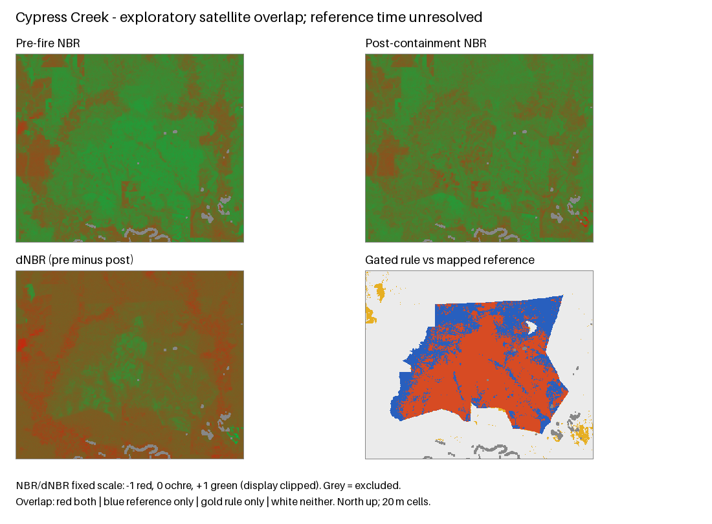

# Cypress Creek: dated satellite development experiment

Date: 2026-09-27 local (acquisition/run records retain their actual UTCs).
Status: **catalogue, imagery crops and fixed baseline executed**. This completes
the first reproducible satellite case, not time-matched validation or M1 acceptance.

Task scope: `backend/vision/` offline runner/tests, `contracts/research/` additive
contract, and this research evidence. Branch `codex/cypress-creek-case`, based on
`origin/main` `3f7ca27` after the earlier research was merged in PR #1. No production
API/frontend or shared lockfile changes. Research/remote-sensing ownership remains
unassigned. The running frontend checkout is separate.

## Frozen inputs

Incident `8432b888-2a01-4825-8eb6-c74589de24fc`; reuse the existing checksummed
[WFIGS source response](results/cypress-creek-wfigs-snapshot.json), rather than a
mutable name lookup. [Configuration](../../../backend/vision/cypress-creek-config.json)
was saved before satellite pixel acquisition. Thresholds remain the prototype's
dNBR >=0.1 and pre-NBR >=0.1, with a plain dNBR comparator. No tuning followed the
results. Configuration hash:
`e4834cced216a77b771695646b84b2d7af76520df61f00bc59ec4ed41aaa374f`.

The source polygon timestamp is **February 27 11:20 UTC**, date-current March 1,
and containment March 9. This mixed-method record does not establish when each
segment was observed or whether it represents the final burned footprint. We did
not resolve that uncertainty. The post-containment scene below is about 14.24 days
after the polygon timestamp. Descriptive overlap is reported; time-matched metrics
are explicitly null. A perimeter interior is not pixel-perfect burned-area truth.

Earth Search Collection 1 (`sentinel-2-c1-l2a`) was selected to avoid importing the
prototype's legacy-collection offset assumption. The [provider's documentation](https://github.com/Element84/earth-search)
instructs applying asset scale and offset; its [legacy collection issue](https://github.com/Element84/earth-search/issues/66)
records offset inconsistencies. For all four selected spectral crops, the STAC and
GeoTIFF metadata agree on scale 0.0001 and offset -0.1. Those terms were applied
after masking DN=0. Unlike a multiplicative scale, an additive offset affects NBR.
This does not validate or change the legacy production provider's behavior.

The [Sentinel Hub NBR example](https://custom-scripts.sentinel-hub.com/custom-scripts/sentinel-2/nbr/)
uses B08 and B12. We average aligned 2x2 B08 samples onto the native 20 m B12/SCL
grid. A missing contributor stays unknown. The study rectangle is 463 by 383 cells
in EPSG:32615, 7,093.16 ha, with a 1 km perimeter-bounds buffer. The two source rings
are preserved with even-odd topology. Projected polygon area is 2,732.159 ha; centre
rasterization is 2,732.4 ha. Both are distinct from the publisher's GIS area attribute.

## Acquisition selection and coverage

Pre window: February 10 through February 24 before discovery. Post window: March 9
at containment through March 24. All six catalogue items are retained. One pre scene
was excluded by the fixed <=60% tile cloud screen. Among the five eligible scenes,
the chosen pair maximized local joint SCL-valid coverage, without inspecting dNBR
or reference agreement. Other SCL-valid AOI fractions were 30.22% on February 11,
71.73% on March 18 and 27.16% on March 23. No acquisition failures occurred.

| Input | Selected scene | Exact acquisition UTC | Processing baseline |
| --- | --- | --- | --- |
| Pre-fire | `S2C_T15RUQ_20260216T170151_L2A` | 2026-02-16 17:05:10.189 | 05.12 |
| Post-containment | `S2B_T15RUQ_20260313T170110_L2A` | 2026-03-13 17:05:05.448 | 05.12 |

Cloud/shadow/no-data and all SCL classes except vegetation/non-vegetated/water are
excluded for both dates, with a one-cell uncertainty buffer. Radiometric validity
is also required. **97.887%** of the AOI and **99.814%** of the reference polygon
remain valid: 173,582 cells total, with 127 reference cells excluded. The predeclared
95% coverage gate passes. It is not an independent cloud-quality certification.

## Measured descriptive overlap

These numbers compare spectral candidates with an earlier mapped incident extent.
They are conditional on valid pixels and this particular buffered AOI. They do not
estimate unseen-incident accuracy or active-flame detection quality.

| Fixed method | IoU | Dice | Precision | Recall | Candidate area, ha | Area bias |
| --- | ---: | ---: | ---: | ---: | ---: | ---: |
| dNBR >=0.1 | 0.6210 | 0.7662 | 0.9451 | 0.6443 | 1,859.32 | -31.83% |
| dNBR >=0.1 and pre-NBR >=0.1 | 0.6212 | 0.7663 | 0.9473 | 0.6434 | 1,852.44 | -32.08% |
| Disc using known perimeter area and reported origin | 0.5390 | 0.7004 | 0.7122 | 0.6890 | 2,638.20 | -3.27% |
| All negative | 0 | 0 | undefined | 0 | 0 | -100% |

The valid mapped-reference area is 2,727.32 ha. The gated rule has 43,871 overlapping,
2,440 outside-reference and 24,312 inside-reference/non-candidate cells. It marks
874.88 ha less area on valid support. The area-informed disc is an oracle comparator,
clipped to the AOI and validity mask; its area advantage is not predictive skill.

The two spectral rules are nearly indistinguishable on this case. The gated rule's
Dice exceeds the geometric comparator here, but one inspected case and an uncertain
reference do not establish improved model performance. No confidence interval based
on treating correlated pixels as independent samples is reported.

Assistant visual inspection of this derived map finds the main spectral change
inside the mapped footprint, with extensive inside-reference non-candidate regions,
particularly toward the north, and some outside-reference candidates. Causes remain
unverified: unburned interior patches, low-severity/under-canopy burns, phenology,
other land changes, residual cloud/shadow and time/registration differences can all
contribute. This inspection is not independent human annotation.

## Evidence and reproduction

- [Machine-readable result](results/cypress-creek-satellite/report.json)
- [Catalogue manifest](results/cypress-creek-satellite/catalog/catalog-manifest.json): all requests, scenes, dates and checksums
- [Acquisition manifest](results/cypress-creek-satellite/acquisition/acquisition.json): native crop hashes, full-asset publisher multihashes, metadata and selection coverage
- [Offline format](../../../contracts/research/satellite-case.md) and [runner instructions](../../../backend/vision/README.md)

Small JSON provenance and the overview are tracked. Native crops and generated
GeoTIFFs remain local under `backend/vision/data/cypress-creek/` and
`backend/vision/runs/cypress-creek-v1/`. Local hashes verify those saved crops, not
the complete remote COG bytes. Exact raw STAC responses and selected item documents
are retained in the tracked evidence folder; recataloguing later may produce new
metadata and therefore new hashes. Offline evaluation requires the retained crops,
or freshly acquired ones whose provenance must be compared explicitly.

The runner refuses existing output directories. It records failed acquisition
candidates, and never silently substitutes synthetic imagery. Synthetic unit tests
check numerical/provenance behavior; they are not scientific observations.

Validation: **70 Python tests passed**, including 12 new satellite checks. An offline
replay from the worktree and retained catalogue produced identical scores and
identical hashes for all six GeoTIFFs and the PNG. All nine native crop hashes,
bounds, dimensions and CRS were checked; selected STAC/GeoTIFF radiometry agreed.
Local documentation links and the comparison figure were inspected.
[Verification record](results/cypress-creek-satellite/verification.json).
Changes are local and uncommitted on the research branch; no new PR or team message
was created. Main remains clean.

## Next dependency

Obtain an independently dated burned-area reference or progression perimeter and
inspect both source acquisitions for residual cloud, other burns and land changes.
Then evaluate additional independent incidents with these rules fixed. Only after
that should thresholds be calibrated or an ML model be compared on held-out fires.
Do not tune until this case agrees with the perimeter. Drone M1 still needs two
qualified human reviewers and compatible incident-separated labels; no M1 status
or trained-model claim changes here.
