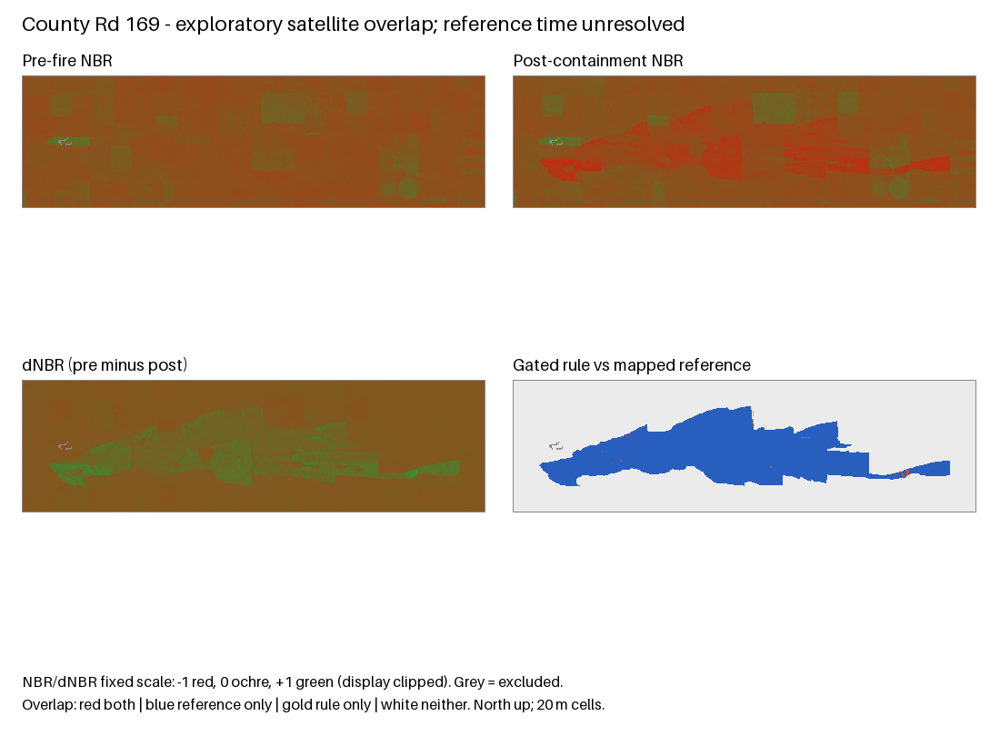

# Satellite transfer pilot and perimeter audit

Date: 2026-09-27 (local; captured source evidence uses UTC).
Status: two additional incidents attempted with unchanged spectral rules. One
passes the coverage gate; neither provides time-matched independent validation.
The pre-fire NBR floor does not transfer reliably in this pilot. No threshold was
tuned, learned model trained, benchmark frozen, or M1 human review completed.

Scope: offline processing in `backend/vision/`, research contracts and evidence in
`contracts/research/` and this directory. No frontend/API interface changes. Research
and vision ownership remain unassigned. The recorded run used
`codex/cypress-creek-case`, with remote main at `3f7ca27`; these are historical
provenance, not current checkout instructions. The application checkout was preserved.

## What the dated reference audit found

The [NIFC WFIGS Daily Perimeters item](https://www.arcgis.com/home/item.html?id=7fa2437e625d49f7af1017c8617b68c1)
describes automatic captures of geometry changes, including intermediate edits and
mistakes. It explicitly disclaims an official progression product. `BurnPeriod`
orders captured changes; it is not a regular time interval. Attribute-only edits
can update the most recent feature. The raw item description, layer metadata,
queries, retrieval UTCs and response SHA-256 values are retained in
[source evidence](results/satellite-transfer/evidence/).

Cypress Creek has seven captured versions. The last equals the perimeter used in
the original experiment. Four versions lack `poly_PolygonDateTime`; three different
valid geometries reuse `2026-02-27T11:20:00Z`. One earlier ring is invalid and is
recorded without repair. An area decrease of approximately 4,040 acres further
shows why version changes cannot be treated as observed spread. The certified
perimeter query returned zero Cypress features. The current history layer returned
one matching geometry. The attempted Texas 2026 public FTP directory returned 404;
this does not establish that no incident archive exists elsewhere.

| Incident | Daily versions found | Published polygon timestamp UTC | Selected post image UTC date | Reference limitation |
|---|---:|---|---|---|
| Cypress Creek | 7 | Feb 27 11:20, reused | Mar 13 | Geometry revisions and observation times are unresolved |
| Rawlins Co TP | 1 | Mar 3 16:32:50.972 | Feb 28 | Image precedes polygon timestamp; Image Interpretation provenance is incomplete |
| County Rd 169 | 1 | Feb 18 19:34:00.593 | Mar 3 | IR Image Interpretation predates containment and post imagery; no source survey obtained |

All three keep `reference_time_verified=false`, `official_progression=false` and
`time_matched_metrics=null`. A timestamp attribute alone is not an independently
verified capture time. No velocity, perimeter growth rate or suppression effect is
inferred from these versions. See the
[Cypress audit](results/satellite-transfer/evidence/cypress-history-audit-v2.json).

## Selection before inspecting new imagery

The original policy searched Jan 1–Jun 30 2026 wildfires of 1,200–10,000 reported
polygon acres in the Cypress UTM zone. It returned only Cypress and Flanders;
Flanders lacked required containment/polygon times. Before requesting new imagery,
the policy was amended to a continental-US bounding rectangle. The original search
and policy are preserved. This is a metadata-selected convenience pilot, not a
representative sample.

The amended response contained 130 candidates. Eligible cases require a unique
incident UUID, non-complex wildfire, valid polygon, discovery/containment times in
order, polygon timestamp between discovery and containment plus 15 days, and a
bounded 20 m grid. Sort by discovery time then UUID. Select the first two whose
origins are at least 100 km from Cypress and each other, with non-overlapping
mapped geometries. Do not replace failed cases after seeing their images or scores.

[Frozen selection](results/satellite-transfer/cohort-v1/selection.json) records
all exclusions and input/code hashes. Rawlins (Kansas) and County Rd 169 (Colorado)
are about 271 km apart and more than 1,100 km from Cypress. Both were discovered on
Feb 17, so distinct identifiers and distance do not imply independent weather,
season or fire regimes. They are now development evidence; a future tuned method
must use new untouched incidents for evaluation.

The baseline remains dNBR >=0.1, with a second rule adding pre-fire NBR >=0.1.
Windows remain 14 days before discovery and containment through 15 days afterward.
Keep the 1 km AOI buffer, 20 m cells, SCL classes 4/5/6, one-cell exclusion buffer,
four shortlisted acquisitions per window, tile cloud <=60%, and >=95% usable
coverage in both AOI and reference. Select scenes by joint valid coverage, never
by reference agreement. There was no post-result threshold change.

County's AOI crosses tiles 13SED/13SFD; the original single-tile catalogue failed.
The [recorded amendment](results/satellite-transfer/evidence/mosaic-method-amendment.json)
adds same-datatake mosaics before acquiring County spectral pixels. Rawlins had
already been evaluated. Tile groups must share platform/datatake ID, jointly cover
the fixed AOI, and span no more than 300 seconds. Choose the first SCL-usable tile
in lexical ID order, then apply the original quality buffer. Never fill from
another date. The case selection, AOI and spectral rules are unchanged. This
acquisition amendment prevents claiming a fully preregistered transfer experiment.

## Measured results

All Dice values below are conditional overlap against operational mapped extent,
not validated pixel accuracy. Cloud-excluded pixels are unknown.

| Case | Valid AOI / reference | Coverage gate | dNBR Dice | dNBR + pre-NBR floor Dice |
|---|---|---|---:|---:|
| Cypress, original development case | 97.89% / 99.81% | Pass | 0.7662 | 0.7663 |
| Rawlins, additional case | 22.12% / 21.15% | **Fail** | 0.8758* | 0.1081* |
| County Rd 169, additional case | 98.93% / 100.00% | Pass | 0.8163 | **0.0070** |

*Rawlins scores describe only the surviving small support and are rejected as a
whole-case result. They must not be pooled with usable cases or cited as successful
transfer. Across the two new attempts, only one passes coverage and zero qualify
for time-matched validation. No aggregate accuracy or pixel-independent confidence
interval is reported.

Rawlins uses Sentinel-2C Feb 8 17:42:48.953Z and Feb 28 17:42:49.080Z. The selected
pre image labels 77,931 of 108,142 AOI cells as cirrus before buffering. On common
valid support the gated rule maps 19.08 ha versus 135.64 reference ha. Its reported
origin is 22.24 m outside the mapped geometry and its oracle-area disc has no
surviving valid support; the disc's zero overlap is not a useful benchmark. The
publisher's 1,521 acres and projected geometry's 640.78 ha also differ; retain both
without silently adjusting geometry or source attributes.

County uses Sentinel-2A Feb 6 17:53:28.805–17:53:31.996Z and Sentinel-2C Mar 3
17:53:06.864–17:53:10.281Z, two tiles per overpass. The plain rule maps 1,626.72 ha
against 2,264.20 reference ha on valid support (28.15% smaller). The pre-NBR floor
reduces candidates to 11.00 ha (99.51% smaller). A post-hoc diagnostic finds median
pre-NBR -0.1125 inside the valid reference; the floor removes 39,505 of 39,704 plain
rule/reference intersections. This explains the failure mechanically. Dormant or
sparse vegetation is a hypothesis, not a verified land-cover label or causal result.

The first three panels show spectral indices; they are not true-colour images.
The final panel shows both masks in red, reference only in blue, rule only in gold,
and neither in white. Grey pixels are excluded. Both generated overviews were
visually inspected for rendering and mask alignment; this is not independent label
review. The exact reports, selected STAC metadata, quality ranking and crop hashes
are in [the result bundle](results/satellite-transfer/README.md).

## Validation and next research decision

Offline replay reproduced all original Cypress raster/PNG hashes and numerical
results after the UTM-zone generalization. Both transfer runs also reproduce every
output hash and score. Component tests cover cohort leakage screens, incomplete
source responses, malformed geometries, repeated timestamps, datatake separation,
capture-time limits and deterministic quality-based tile choice. Test fixtures are
synthetic and do not establish scientific accuracy.

Validation completed: **90 Python component tests passed**, including 20 new audit,
selection and mosaic tests, using the documented `backend/vision` working directory.
`git diff --check` passed. Original Cypress configuration/report hashes were
preserved. Changes are local and uncommitted; main remains clean and no PR or team
notification was created.

The immediate evidence-driven follow-up is to obtain independently sourced dated
reference surveys and register a new development experiment comparing the existing
plain rule with a method that handles low pre-fire NBR. Preserve these cases as
development failures; reserve new incidents before tuning. Rawlins additionally
needs a separately declared acquisition/coverage strategy before it can support a
whole-case claim. Do not quietly expand its dates or replace the case. M1 remains
waiting for two human reviewers and accepted target-compatible drone masks.
