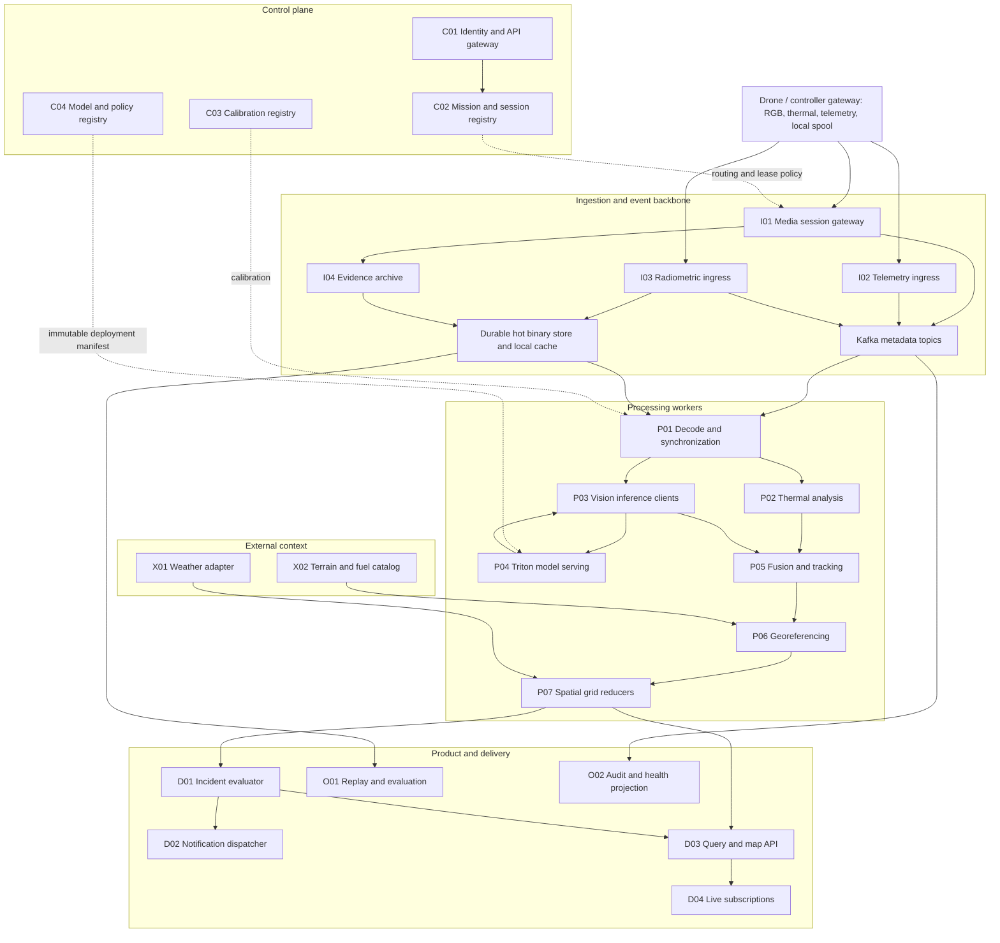

# 1. Architecture and horizontal scaling

## 1.1 Product boundary and invariants

The real-time product reports observations: flame/smoke detections, thermal anomalies, surface-temperature statistics, vegetation candidates, geolocated coverage and changes over time. Forecasting and crew routing are future, independently validated services. No model-generated future image becomes a measured fire perimeter.

The following are mandatory implementation invariants:

1. Every accepted input has tenant, mission, device, session, sensor, source sequence, capture-clock domain, receipt time and provenance. Server receipt time never substitutes silently for capture time.
2. A drone reconnect creates a new session identifier; counters may restart only within that new session.
3. Every result names immutable input, calibration, model, preprocessing, grid and rule versions. Missing measurements use explicit null/status fields; unknown never becomes zero.
4. Only one authorized owner may mutate a given stateful shard in a given ownership epoch. Stale owners must be rejected by the storage transaction, not merely by an in-memory lease check.
5. Real-time work is deadline-bounded. Replay and backfill have separate topics, consumer groups, compute quotas and notification sinks.
6. Binary frames, rasters and clips stay out of Kafka. Events carry bounded metadata and immutable object references.
7. Every expected input sequence receives an accounting status: processed, received-too-late, rejected, source-gap, unavailable-payload or failed. Frame accounting must not present dropped frames as analyzed.
8. A fresh model score is distinct from a tracked/propagated result; raw model scores are not labelled calibrated probabilities without validation.
9. A missing thermal channel does not stop RGB observation publication; a missing RGB channel does not invalidate otherwise usable radiometry. Output quality states explain degraded evidence.
10. A stale weather forecast, stale grid cell or unavailable view is not evidence that fire is absent or an incident is resolved.

## 1.2 Logical topology

Arrows between processing services represent contracted events unless the service catalog explicitly specifies gRPC. Each worker publishes to the event backbone; there is no synchronous HTTP chain across all processors. P03-to-P04 is deadline-bounded inference RPC. Hot payload reads use authorized binary references. Control-plane policies are cached by immutable version and are not fetched synchronously for each frame.

## 1.3 Deployment planes and initial technology choices

| Plane | Recommended starting implementation | Horizontal scaling boundary |
|---|---|---|
| Public/control API | REST/JSON behind OIDC-aware gateway; separate device authentication | Stateless replicas; database capacity remains a separate concern |
| Media ingress | Vendor adapters feeding GStreamer/DeepStream session workers | Sessions assigned to pods; no arbitrary frame-level load balancing of encoded streams |
| Telemetry ingress | MQTT/TLS or vendor SDK adapter, then normalized events | Connections and source stream keys |
| Binary data | S3-compatible immutable objects plus bounded node cache | Storage bandwidth, request rate and key distribution; cache is not authoritative |
| Metadata backbone | Kafka with schema registry and explicit topic ownership | Partitions, consumer groups, broker bandwidth and disk |
| CPU processing | Python or Go workers; compiled numerical routines for raster calculations | Stateless event tasks or leased state shards |
| GPU inference | Triton with fixed model deployments; TensorRT where validated | GPU replicas, model memory, batching and request concurrency |
| State and geographic queries | PostgreSQL/PostGIS, owned schemas, outbox/inbox tables | Read replicas first; mission/tenant write shards when needed |
| Temporary state/cache | Bounded local cache; optional distributed cache | Sharded cache keys; never sole copy of mission/incident truth |
| Browser delivery | REST snapshots, WebSocket changes, separate WebRTC preview gateway | Connection shards and authorized topic fan-out |
| Platform | Kubernetes; CPU, media, GPU and stateful node pools | Pod autoscaling plus independently configured node provisioning |

DeepStream documents decode, preprocessing, batching, inference and tracking components [S1]. Triton distinguishes dynamic batching for independent requests from sequence batching for stateful models [S2]. Prefer independent frame inference and keep temporal tracker state in P05; introducing a recurrent model requires explicit session affinity and a revised recovery contract.

## 1.4 Two paths for media: live analysis and durable evidence

The baseline design uses an append-only hot binary store with short immutable microbatches, not one object for every pixel cell. Thermal frames are grouped into at most 100 ms batches (one frame at 5 FPS). Original encoded RGB packets are committed in short chunks while P01 maintains a live decoder. A frame reference identifies its capture sequence, encoded chunk/offset and the complete decode dependency range back to an available keyframe. Every dependency must be committed before the reference is ready; chunks are not assumed independently decodable. Decoded RGB tensors are bounded transient cache entries, not the baseline permanent archive format.

P03 uses the live decoded tensor when available; on another node or after eviction it reconstructs the referenced frame from the committed source range. Prefer placement and sequential batching that reuse a decoder/cache and avoid repeatedly decoding a GOP for individual frames. Ordinary cross-node inference RPC still transmits tensor bytes; it is not zero-copy. The capacity calculator exposes the worst-case decoded RGB fabric load. Shared-memory optimizations require P03 and P04 to be colocated and their lifecycle explicitly coordinated; they cannot span arbitrary nodes.

Publication barrier: `frame.ready` and `thermal.ready` must not reference an object until its upload is finalized, its checksum verified and it is readable in the processing region. Metadata contains object version, byte offsets, frame offsets, encoding, byte order, shape and SHA-256. No presigned URLs are persisted in Kafka. Consumers authorize reads with workload credentials using the object key and tenant scope.

The selected hot-store implementation must demonstrate the upload/read tail latency assumed by the SLO. Provisioned durable regional NVMe object nodes or a measured regional object service are candidates; this document does not assume all S3-compatible stores have identical latency. If a future zero-copy, node-local optimization bypasses that barrier, it must be marked provisional and cannot inherit the baseline durability claim.

I04 records the original encoded RGB stream in short durable chunks and compacts it into independently decodable archive segments with a keyframe index, plus original thermal measurements and metadata. Live analysis does not await a closed multi-second archive segment: committed chunks plus their decode dependencies have their own durable lifecycle. Compaction retains a versioned mapping from frame IDs and original offsets to archive segments; old references resolve through that mapping. Remove source chunks only when compaction integrity is verified and all hot-read leases have expired.

Hot analysis batches: proposed 24-hour retention, longer for active replay/read leases. Original media: proposed seven days, subject to cost and tenant policy. Incident evidence: pinned until its separate retention policy expires. Garbage collection checks durable reference manifests, retention leases and active jobs; object age alone is insufficient. Content deduplication, if introduced, must retain tenant isolation and not create cross-tenant existence side channels.

## 1.5 Scaling units and state ownership

| Work | Partition/shard key | State and owner |
|---|---|---|
| Encoded video decode | tenant / mission / session / RGB sensor | One active decoder owner; stream offset and codec state |
| RGB/thermal/pose pairing | tenant / mission / session | One P01 synchronization shard; bounded source buffers |
| Frame inference | analysis run / model version / frame or tile ID | Stateless task; freely distributed GPU calls |
| Temporal fusion/tracking | tenant / mission / session / analysis run | One P05 owner; event-time reorder buffer and tracker checkpoint |
| Georeferencing | observation ID / calibration version | Stateless; immutable terrain/cache inputs |
| Ground grid | tenant / mission / grid version / spatial tile / analysis run | One P07 reducer owner per tile |
| Incident decisions | tenant / mission / analysis run | One D01 owner initially; consumes compact event candidates, not pixels |
| Notifications | tenant / incident / revision / channel / destination | Idempotent delivery record with provider receipt |
| Browser subscriptions | tenant / mission / connection ID | Connection-local state, resumable from durable event cursor |

Horizontal scaling increases the number of distinct sessions/tiles that can be processed concurrently. A single ordered shard still has a throughput ceiling. Measure that ceiling and reject excess admission; adding replicas does not accelerate a single tracker or incident-owner shard automatically.

D01 is intentionally mission-owned to avoid duplicate incident identity/merge decisions across tile boundaries. If one mission exceeds the validated D01 rate, introduce stable operational sub-AOIs with a mission-level reconciliation stage and a new contract version. Do not implement uncoordinated spatial incident writers and hope deduplication will repair alerts afterwards. Multi-drone observations in the same mission feed the same incident owner; independent missions are not automatically one incident namespace.

## 1.6 Ownership, rebalances and fencing

Kafka group assignment chooses candidates to own stateful partitions. On assignment, a worker claims a service-specific shard lease using a database compare-and-swap that increments `owner_epoch`. Proposed TTL: 15 seconds; heartbeat: 5 seconds; a worker stops accepting work before its lease can expire. The lease store uses a single authoritative primary per regional shard.

The storage transaction that applies a checkpoint/result must verify the current lease owner, unexpired lease and epoch. The same transaction stores the consumed event ID, state revision and output event in an outbox. Consequently a paused old pod cannot commit when it resumes after lease transfer. Outbox publication may repeat; downstream inbox keys suppress repeats. Stateless services use event identity without a lease where no mutable shard is owned.

Track state checkpoints include next expected source sequence, last effective capture time, buffered result IDs, model/calibration versions and source offsets. Recovery replays uncommitted inputs. Reproducibility of GPU floating-point outputs is not guaranteed; revision IDs and evidence provenance expose recomputation. Exported track IDs are stable within a session/run; unavoidable tracker resets emit a reset event and a new track generation.

Partition count changes can move keys and invalidate ownership assumptions. For ordered topics, use a versioned successor topic, drain/barrier, checkpoint transfer and new ownership epoch. Do not expand an active ordered topic without this procedure. Kafka ordering is partition-local, not a total order across topics or event capture times [S3].

## 1.7 Regions, deployment phases and unavailable dependencies

Pilot: one region, one drone, shared control/query deployment, dedicated media worker, one processing worker and suitable GPU inference, durable storage. Logical service contracts remain intact even when several services share a process. This is a development topology, not the HA target.

Production reference: one region, three failure zones where available, minimum two stateless API replicas, Kafka replication factor three with minimum ISR two, highly available PostgreSQL, replicated binary storage and at least two warmed inference replicas for active critical models if the measured workload and failure budget require them. Synchronous database failover settings and storage durability must be tested, not inferred from replica count.

Regional expansion: allocate each mission a home region; route ingestion and queries through a directory. Copy durable evidence asynchronously to the recovery region if required. A failover procedure fences the old region, advances the mission region epoch and advertises the last recovered event/object watermark. The product must display the recovery gap. Writes cannot continue independently in both regions for the same mission.

GPU, terrain, weather and cloud failures have distinct degraded states. A failed species model must not stop the temperature grid. Missing weather must not stop measured hotspot publication. Missing trustworthy projection must suppress geographic geometry while preserving image-space evidence. No degraded mode silently substitutes generated data for measurements.

## Sources

- S1: [NVIDIA DeepStream overview](https://docs.nvidia.com/metropolis/deepstream/dev-guide/text/DS_Overview.html)
- S2: [NVIDIA Triton batching](https://docs.nvidia.com/deeplearning/triton-inference-server/user-guide/docs/user_guide/batcher.html)
- S3: [Apache Kafka design and delivery semantics](https://kafka.apache.org/41/design/design/). Cited for stable mechanisms; 4.1 is not a recommended deployment version. Pin a supported tested release during implementation.
- S4: [Kubernetes horizontal pod autoscaling](https://kubernetes.io/docs/concepts/workloads/autoscaling/horizontal-pod-autoscale/)
- S5: [Kubernetes GPU scheduling](https://kubernetes.io/docs/tasks/manage-gpus/scheduling-gpus/)
- S6: [KEDA Kafka scaler](https://keda.sh/docs/2.18/scalers/apache-kafka/). Check the chosen version's partition and inactive-consumer behavior before deployment.
- S7: [FLIR measurement parameters](https://docs.flir.com/T810605/en-US/latest/s10.html)
- S8: [Open-Meteo weather time and model metadata](https://open-meteo.com/en/docs)

All service boundaries, numerical budgets and operating policies in this package are proposed Firewatch design choices, not vendor performance claims.
