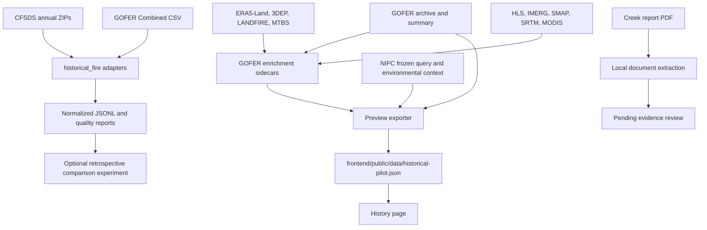

# Historical research data: sources and usage

Audited **2026-09-28** against the local checkout and cached files. Start here for
historical data work; older experiment reports describe the runs made at that time.

- [Source register and attribution](sources.md)
- [Acquisition, reproduction and validation](reproduce.md)
- [Data contribution guide and starter tasks](contributing.md)
- [Machine-readable audit snapshot](audit-2026-09-28.json)
- [Earlier research protocols and findings](../concurrent-analysis/09-historical-similarity/README.md)

## What is actually present

The only `.research-data` directory found is `backend/api/.research-data/`, ignored
by Git. It contains **2,319 files / 762,688,169 bytes** (762.7 MB decimal).
A fresh clone does not include this cache. Counts include downloads, cached service
responses, backups and generated results; they are not counts of independent observations.

| Relative to `.research-data/` | Files | Bytes | Meaning |
| --- | ---: | ---: | --- |
| `GOFER-v02.zip` | 1 | 75,711,678 | Original GOFER archive, locally renamed |
| `GOFERC_summary.csv` | 1 | 3,913,711 | Combined summary extracted from that archive |
| `cfsds-v1.1/` | 20 | 25,680,800 | Pinned annual Canadian dataset archives, 2002–2021 |
| `enrichment-pilot/` | 2,275 | 212,327,149 | Three GOFER pilots, source responses, report PDF, pending extracted facts and exploratory caches |
| `nifc-pilot/` | 11 | 260,961 | Frozen query, two perimeter snapshots and environmental context |
| `results/` | 11 | 444,793,870 | Normalized situations, quality reports and older retrospective comparison outputs |

The cached CFSDS v1.1 import contains **82,108 daily situations / 4,164 fires**;
76,919 situations meet the earlier experiment's matching requirements. This differs
from the publication's original v1 counts. The GOFER summary import contains
**20,273 hourly intervals / 28 fires**; one initial snapshot per fire is excluded
because it has no preceding interval. These imports are distinct from enrichment.

Only **216 GOFER intervals** are enriched: the first 72 available hours each for
Creek (2020), Kincade (2019) and Bobcat (2020). Each has 49 measurement slots,
including nulls and repeated fields from different sources/spatial supports.
There are 111 newly burned footprints and 105 intervals without one. All three
72-hour windows are contiguous. Zero mapped growth is not a missing timestamp.

| GOFER pilot | Hourly intervals | Newly burned footprints | Hours with all eight UI parameters |
| --- | ---: | ---: | ---: |
| Creek 2020 | 72 | 63 | 51 |
| Kincade 2019 | 72 | 15 | 13 |
| Bobcat 2020 | 72 | 33 | 0 |

These counts use the current viewer's `eventAvailability` function. Across the pilot,
64 hours meet that UI definition; none has all 49 measurement slots non-null because
FIRMS detections remain uncollected.

The bundled historical viewer contains **218 records / five events**: those 216
hours plus one NIFC snapshot each for Cypress Creek and County Rd 169. The latter
are not hourly progression observations. The audit verified all 20 CFSDS checksums
and all three GOFER sidecar hashes referenced by the viewer export.

## Where the data goes

| Producer / consumer | Input and use | Output / boundary |
| --- | --- | --- |
| [acquire.py](../../backend/api/historical_fire/acquire.py) | Downloads CFSDS files from the pinned manifest; checks SHA-256 | Annual ZIPs; does not acquire GOFER |
| [adapters.py](../../backend/api/historical_fire/adapters.py), [runner](../../backend/api/historical_fire/__main__.py) | Normalizes CFSDS daily and GOFER hourly records separately | `results/*situations.jsonl`, quality/manifests; comparisons only with `--run-comparisons` |
| [enrichment_core.py](../../backend/api/historical_fire/enrichment_core.py), [enrichment_run.py](../../backend/api/historical_fire/enrichment_run.py) | Joins GOFER times/perimeters; derives newly burned footprints and queries base sources | `enrichment-pilot/data/gofer-*/intervals.json`, base reports, raw caches |
| [enrichment_nasa.py](../../backend/api/historical_fire/enrichment_nasa.py) | Adds NASA context to existing interval sidecars | Updates full intervals, saves pre-enrichment backup; leaves simple previews and base reports unchanged |
| [nifc.py](../../backend/api/historical_fire/nifc.py) | Normalizes two frozen NIFC records; optionally queries EE context | `nifc-pilot/nifc-*/snapshot.json`; growth remains null |
| [export_preview.py](../../backend/api/historical_fire/export_preview.py) | Joins full sidecars to original GOFER perimeters and optional NIFC snapshots | Compact static export with 20 m display simplification and source hashes |
| [HistoryPage.tsx](../../frontend/src/history/HistoryPage.tsx), [model.ts](../../frontend/src/history/model.ts) | Fetches `data/historical-pilot.json`; renders timeline, perimeter and measurements | No direct cache access or browser Earth Engine credentials |
| [historical_documents.py](../../backend/llm/historical_documents.py) | Reads acquired PDF; produces evidence-linked candidate facts | `enrichment-pilot/documents/*`; pending review, not automatically merged into intervals |

The simulation kernel in `frontend/sim/` does not train on this directory. The
canopy model has its own [sampler and training files](../../frontend/api/src/canopy/)
and LANDFIRE training table. Observation research in `backend/vision/data/` and
`backend/vision/runs/` is separate; consult its [dataset register](../concurrent-analysis/09-observation-baseline/datasets.md).
Some providers are shared in name, but these are different acquisition pipelines.

## Important distinctions for readers

- `intervals.json` is the full enriched sidecar. Current `intervals-simple.json`
  files retain the **29-slot base stage**, with coordinates removed. They are not
  current 49-slot duplicates. The viewer exporter uses the full file.
- `before-after-completeness.json`, `event-enrichment.json` and `pilot-manifest.json`
  describe base enrichment; the NASA pass does not refresh those reports.
  Inspect full sidecars and the dated audit for later source presence.
- `enrichment-pilot/data/raw/` is the active enrichment cache. The parent
  `enrichment-pilot/raw/`, `landfire-test/`, `landfire-smoke-v3/` and
  `landfire-smoke-v4/` are exploratory artifacts, not inputs selected by the exporter.
- UI “complete” means the eight displayed parameters are usable on the requested
  support: NDVI, NDMI, NBR, fuel, slope, wind, temperature and humidity. It does not
  mean all 49 slots, all source checks, human review or intervention history are complete.
- A null footprint summary must stay separate from ignition-point context. Monthly
  burned area, pre-fire imagery, 3-hour soil moisture and final perimeter checks do
  not become hourly observations because they appear in an hourly record.
- Different services hosting the same product are not independent confirmation.
  Suppression is unmeasured: absence of intervention records does not establish
  an untreated fire. No verified pre-intervention cohort is currently documented.
- Outcome-footprint measurements are retrospective. Historical growth can reflect
  suppression as well as environment; this collection cannot by itself validate a
  simulator that omits intervention or establish future forecast accuracy.

## Publication readiness

Original code/docs already have an [MIT license](../../LICENSE). Dataset and imagery
rights remain source-specific; see [third-party notices](../../THIRD_PARTY_NOTICES.md).
The source register records terms links and unresolved checks, not blanket clearance
to publish the cache. Review terms for the tracked examples and browser bundle as
well as raw data before releasing a dataset package. Live collections can change;
a repeat query is not guaranteed to recreate cached bytes.

## Audit verification

This documentation pass checked local source hashes, interval IDs, one-hour durations,
internal continuity, source/measurement-slot counts and the viewer's source hashes.
The actual exporter rebuilt all 218 records to a temporary file; its validated output
matched the tracked preview **byte for byte**. All five historical CLI `--help`
commands completed, and the viewer's own availability function produced the table
above. Local documentation links, issue-form YAML and whitespace were checked.

No live acquisition or model extraction was rerun, and no source data or application
code was changed. The full application test suite was not required for this
documentation-only change. This audit does not constitute domain review of each
measurement or clearance of every source's redistribution terms.
