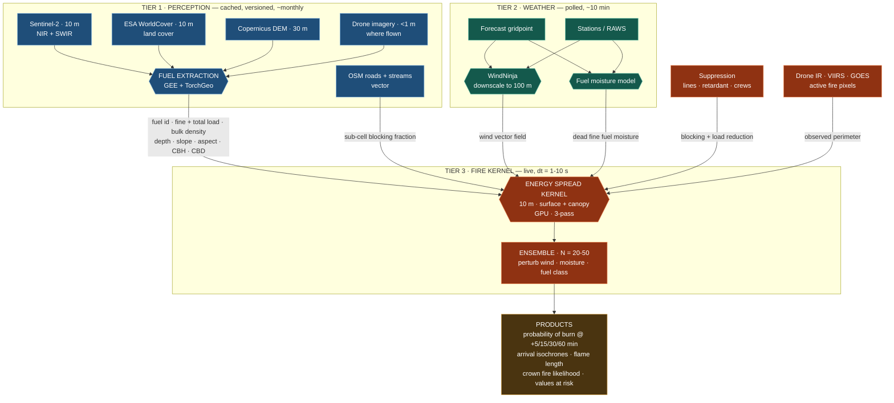
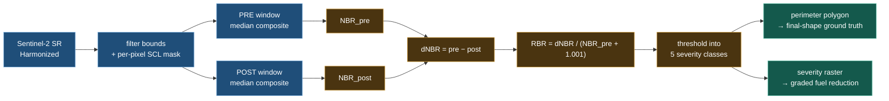
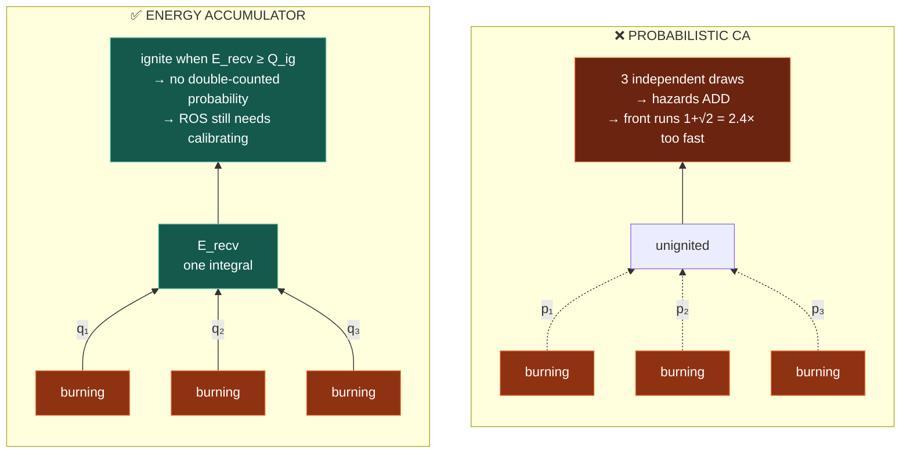
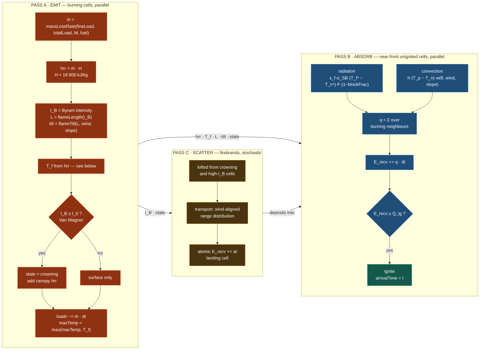
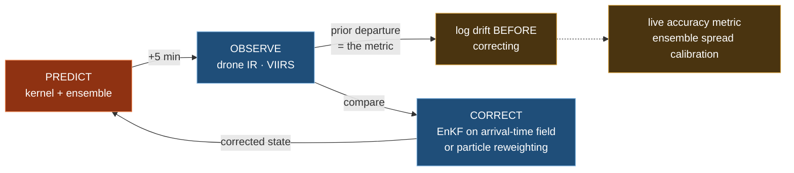
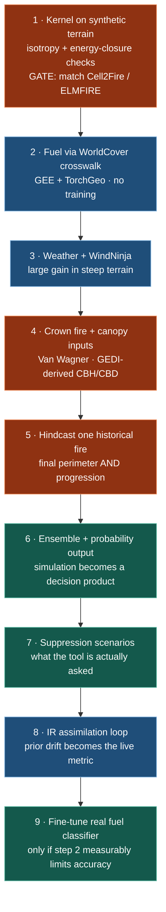

# Wildfire Spread Prediction — Architecture

Fuel extracted from satellite imagery, energy accounted for cell by cell, spread predicted on a
rolling 5-minute horizon, and corrected against where the fire observably is.

> **Status: proposed target design. Mostly not implemented.** What ships is a smaller thing: a
> front-tracking kernel on a ~38 m grid in `frontend/sim/src/model.ts`, described in `README.md`.
> Read this as where the model is going, never as a description of the code.
>
> **Two things here have since landed, by different means than §4 proposes.** §4's `1+√2`
> front-speed error is fixed — not by an energy accumulator but by Finney (2002) minimum-travel-time
> propagation, which made the front advance at the rate the kernel reports, within 6%. And
> directional spread is Richards (1990) elliptical, not the cosine-scaled `φ_w` §4 criticises.
> §9's provider ports are fully implemented and every one of the ten is now real.
>
> What remains proposed: the 10 m grid, GPU execution, GEE-derived fuel, the ensemble, and the
> IR assimilation loop of §6.

## Four decisions this design commits to

| | |
|---|---|
| **Grid is 10 m, not 2 m** | A memory wall, not a compute preference — and there is no area-wide 2 m fuel data to spend it on. Fine-scale barriers handled as vectors, drone refinement as a local overlay. |
| **The accumulator sits on the receiving cell** | Spread is driven by received energy, not by the emitting cell's max temperature. This removes a specific artifact — double-counted ignition probability — and nothing more; see the honesty note in §4. |
| **Two fuel layers, not one** | Surface and canopy, with an explicit crowning criterion. A surface-only kernel cannot be wrong-but-useful in closed forest; it is just wrong, and closed forest is the target. |
| **Learned perception, physics kernel** | Vision has abundant labels. Fire physics has to extrapolate to conditions no training set contains. |

---

## 1 · System



The tiers are split on refresh rate, because that is also how they fail:

| Tier | If it goes down |
|---|---|
| Perception | Run on the last known-good raster. It changes monthly anyway. **Unless the incident is outside every cached tile** — then Tier 1 is as hard a dependency as the kernel, and the fallback is a WorldCover crosswalk with no Sentinel-2 refinement. Pre-cache the whole service area, not just recent incidents. |
| Weather | Hold the last observation, widen the ensemble spread. |
| Fire kernel | **No product.** The only always-hard dependency. |

---

## 2 · What to use, and where it plugs in

| Library | Verdict | Use it for | Caveat |
|---|---|---|---|
| **Google Earth Engine** | ⭐ Backbone | Hosts Sentinel-2, WorldCover, Copernicus DEM in one place with server-side compute. Severity mapping, fuel layers, hindcast ground truth — no imagery download at all | Free for research; commercial use needs a paid Cloud licence. Batch only — never in the live loop |
| **TorchGeo** | ✅ Backbone | CRS reprojection, tiling, samplers, Sentinel-2 multispectral pretrained weights. For anything GEE can't do server-side | — |
| **ESA WorldCover v2** | ➕ Add — v1 | Land cover → fuel model crosswalk. Ships Tier 1 in days with no training at all | 11 coarse classes at 10 m; does not separate timber from scrub, and carries no canopy base height or bulk density — those need Sentinel-2/GEDI or assumed per class |
| **Prithvi + TerraTorch** | ↪️ Redirect | Its *encoder*, fine-tuned for fuel | GEE dNBR is cheaper for burn-scar mapping. Needs 6-band HLS with NIR + SWIR, not JPEG |
| **SegFormer** | ✅ Fallback | Fuel classifier, only if the WorldCover crosswalk proves too coarse | ADE20K weights are ground-level RGB — retrain and widen the input layer |
| **GEDI / canopy height** | ➕ Add — gap | Canopy base height and bulk density for the crowning criterion (§4) | Sparse sampling; needs gap-filling against Sentinel-2 to make a raster |
| **Ultralytics YOLO** | ↪️ Redirect | Structures and vehicles for values-at-risk — not fuel cover | Boxes, not dense cover. **AGPL-3.0** if this ever ships commercially |
| **flirimageextractor** | ✅ Core | Drone IR → observed perimeter, and observed max temp to score the kernel against | Needs a radiometric camera (DJI H20T, FLIR) |
| **WindNinja** | ➕ Add — gap | Mass-consistent terrain wind downscaling. Large accuracy gain in steep ground, though the figure is unmeasured here | Diagnostic, not prognostic: no fire-induced flow |
| **Cell2Fire / ELMFIRE** | ⭐ **Gate, not a nice-to-have** | Benchmark the kernel against an established model on identical inputs | See §4 — the energy formulation has no explicit ROS to calibrate against, so an external reference is the only calibration handle |

Two entries do a different job than the obvious one, and neither is wasted — YOLO earns its place on
values-at-risk rather than fuel cover, Prithvi as a fuel encoder rather than a burn-scar mapper.

---

## 3 · Severity mapping in Google Earth Engine

The cheapest high-value item on the list. Burn severity from **dNBR** needs no model, no training and
no local imagery — GEE holds the whole archive and computes server-side.



```js
// Khosrov Forest Reserve, August 2017
var geom = ee.Geometry.Rectangle([44.86, 39.925, 45.04, 40.04]);

// Scene-level CLOUDY_PIXEL_PERCENTAGE is NOT a cloud mask: a median composite over a
// month still carries cloud and — worse for dNBR — cloud shadow, which depresses NIR
// and inflates apparent severity. Mask per pixel with the scene classification layer.
var maskSCL = function (img) {
  var scl = img.select('SCL');
  var bad = scl.eq(3)                    // cloud shadow
    .or(scl.eq(8)).or(scl.eq(9))         // cloud medium/high probability
    .or(scl.eq(10))                      // thin cirrus
    .or(scl.eq(1));                      // saturated / defective
  return img.updateMask(bad.not());
};

var s2 = ee.ImageCollection('COPERNICUS/S2_SR_HARMONIZED')
  .filterBounds(geom)
  .filter(ee.Filter.lt('CLOUDY_PIXEL_PERCENTAGE', 60))  // cheap prefilter only
  .map(maskSCL);

// NBR = (NIR − SWIR2) / (NIR + SWIR2)   ·   B8 = NIR 10 m, B12 = SWIR2 20 m.
// Mixed native scales: normalizedDifference adopts the FIRST band's projection, so this
// silently resamples B12 to 10 m. Pin the analysis scale to 20 m at every reduce/export
// rather than inheriting 10 m and pretending to a resolution SWIR2 does not have.
var nbr = function (img) { return img.normalizedDifference(['B8', 'B12']).rename('NBR'); };

var pre  = nbr(s2.filterDate('2017-07-01', '2017-08-01').median()).clip(geom);
var post = nbr(s2.filterDate('2017-09-01', '2017-10-01').median()).clip(geom);

var dnbr = pre.subtract(post).rename('dNBR');

// RBR handles heterogeneous pre-fire cover better than raw dNBR
var rbr  = dnbr.divide(pre.add(1.001)).rename('RBR');

// Every reduction and export pins scale explicitly. 20 m = SWIR2 native.
var ANALYSIS_SCALE = 20;
```

Severity classes, after Key & Benson / USGS:

| dNBR | Class | Fuel reduction applied |
|---|---|---|
| < 0.10 | Unburned | none |
| 0.10 – 0.27 | Low | surface fine fuel −40 %, canopy untouched |
| 0.27 – 0.44 | Moderate-low | surface −70 %, canopy −20 % |
| 0.44 – 0.66 | Moderate-high | surface −85 %, canopy −60 % |
| > 0.66 | High | surface −95 %, canopy −95 % |

**Three uses, and the third is the one usually skipped.**

1. The perimeter polygon is *final-shape* ground truth. It is necessary and not sufficient — a Dice
   score against a final perimeter can be high while the dynamics are wrong, because the same shape
   is reachable at many wrong speeds. It scores the endpoint, not the forecast.
2. **Time-resolved progression is a separate data requirement.** VIIRS (375 m, ~2 overpasses/day),
   GOES/Meteosat (sub-hourly, coarse) and any drone IR flown at the time are what actually score a
   5-minute product. A model validated only on final perimeters is untested as a *forecast*. Build
   the progression archive alongside the perimeter archive.
3. The severity raster feeds back into Tier 1 as a **graded fuel reduction, not a zero-fuel mask.**
   Recently burned ground is not inert: grass recovers in one season, and a low-severity understory
   burn leaves the canopy intact and thus crown-available. Reduction by severity class **and** by
   time since fire — recovery on the order of 1–3 years for grass, 10+ for timber.

**Do not put GEE in the live loop.** Export latency and quotas make it a batch tool. Fuel, DEM and
severity are batch. The kernel and the assimilation loop are not.

---

## 4 · The spread kernel

### Why the accumulator sits on the receiver



Both sides show one unignited cell with three burning neighbours — the ordinary case anywhere along a
fire front. The left is quantifiable: with a per-link `p = 1 − exp(−ROS·Δt/d)`, the orthogonal
neighbour contributes hazard `ROS/h` and the two diagonals `ROS/(h√2)` each, so the total is
`(1 + 2/√2)·ROS/h = (1+√2)·ROS/h`. The front advances **2.414× the model's own nominal rate**, before
percolation compounds it. This was not hypothetical — it was the formulation in the kernel, and
measured at **4.45×** once percolation was included.

> **This defect is fixed, and not by the accumulator below.** Finney (2002) minimum-travel-time
> propagation replaced the per-step draw with a deterministic shortest-arrival search, and the
> front now advances within 6% of the nominal rate on every wind case in the bench. The argument in this
> section stands as a diagnosis; its proposed remedy was overtaken by a cheaper one.

### Honesty note: what the accumulator does and does not fix

It is worth being exact here, because the temptation is to claim too much.

**What it fixes.** A per-link probability calibrated so that *one* burning neighbour reproduces the
target ROS is being applied three times. That is double-counting of probability, and it is an
artifact with no physical referent. The accumulator removes it.

**What it does not fix.** Three flames really do deliver ~3× the flux of one, so the accumulator
ignites a cell on a planar front sooner than a cell at a point source. Configuration dependence
persists — it is simply *physical* now rather than artifactual. Energy conservation does not pin front
speed. The `Σ energy = Σ fuel × H` check in Verification is satisfied by construction, since
`hrr = ṁ·H` — it tests bookkeeping, not behaviour. **Emergent ROS remains a calibration target that
must be hit against an external reference.**

**And the deeper caveat.** At 10 m, this is a sub-grid parameterization wearing the clothes of
first-principles transport. Radiative preheating acts over roughly a flame length, 1–3 m. The
reaction zone is 0.1–1 m deep. A 10 m cell is much larger than both, so most of the propagation being
modelled happens *inside* a cell, and the inter-cell fluxes are effective coefficients that have to be
tuned — exactly like the empirical models this design positions itself against, and which are
calibrated at this scale already. The formulation buys order-independence, a clean assimilation
target, and freedom from the `1+√2` artifact. It does not buy freedom from calibration. Cell2Fire or
ELMFIRE on identical inputs is therefore a gate on step 1, not a later nicety.

### Per-cell state

Split by who writes it, because that determines what must be double-buffered.

| Field | Unit | Scope | Notes |
|---|---|---|---|
| `state` | enum | per member, **neighbour-visible** | unignited / surface / crowning / burnt |
| `hrr` | kW/m² | per member, **neighbour-visible** | 0 unless burning; drives `T_f` |
| `fineLoad` | kg/m² | per member | remaining 1-h fuel — the fraction that carries the front |
| `totalLoad` | kg/m² | per member | remaining all-size load — drives residence time and total heat |
| `canopyLoad` | kg/m² | per member | 0 until crowning consumes it |
| `moisture` | fraction | per member | from Tier 2, perturbed per member |
| `E_recv` | kJ/m² | per member | **the accumulator** — written only by the owning cell |
| `arrivalTime` | s | per member | −1 until ignited |
| `maxTemp` | K | per member | diagnostic; see below |
| `fuelId`, `bulkDensity`, `depth`, `σ`, `slope`, `aspect`, `CBH`, `CBD`, `blockFrac` | — | **shared across members** | static per incident; stored ×1, not ×N |

On `maxTemp`: the earlier phrasing — "never read by the kernel" — was wrong as written, because flame
temperature `T_f` drives the radiative term. The correct statement is narrower and still useful: **a
cell's temperature *history* is never an input.** `T_f` is recomputed each step from `hrr`; `maxTemp`
is a running max kept only so it can be scored against radiometric drone IR. Nothing reads it back.

### Three passes

Firebrands were previously inside Pass B. They do not belong there: spotting is long-range and
*scatters* to distant cells, which breaks both the stencil pattern and any narrow-band iteration over
the front. It gets its own pass.



Pass C deposits energy rather than igniting directly, so a firebrand landing in wet fuel does what a
real one does — nothing — and two brands landing together do more than one. It uses an atomic add
because several brands can target one cell in a step. This is the one genuinely stochastic term, and
it is the reason ensemble members diverge even under identical weather; that is intended, but it means
a single member is not reproducible without its RNG stream. Seed per `(member, step)`, never per
thread, or results stop being reproducible at all.

#### Ignition threshold

```
Q_ig = (581 + 2596·M) · ρ_b · δ · ε        kJ/m²
       └── Rothermel heat of preignition ──┘        ε = exp(−138/σ)
       581 kJ/kg dry  →  1 360 kJ/kg at 30 % moisture
```

**`ε` is not optional.** Rothermel applies the heat of preignition to `ρ_b·ε`, not to the whole bed:
only fuel close enough to the flame to reach ignition temperature acts as a sink. Omitting it — as the
previous form of this document did — means heating every kilogram in the cell, including coarse
material that never ignites in the flaming front. For fine, grassy beds (`σ ≈ 2000 ft²/ft³`) the
correction is small, `ε ≈ 0.93`. For timber and slash with a low bed-weighted `σ` it is an order of
magnitude, and the result is fuel that will not carry fire at all. That is precisely the failure the
kernel cannot afford in Dilijan. Equivalently, and easier to source from Tier 1: apply `Q_ig` to the
**fine (1-h) load only**, which is why `fineLoad` and `totalLoad` are separate fields.

#### Flame temperature

`T_f` was previously left undefined while the radiative term went as `T_f⁴` — making the most
sensitivity-critical quantity in the kernel implicit. Define it explicitly:

```
T_f = T_amb + ΔT_max · tanh(hrr / hrr_ref)        K
```

A bounded, saturating map from heat release rate to an effective radiating temperature, with
`ΔT_max ≈ 1000–1100 K` and `hrr_ref` fitted per fuel against flame-temperature measurements.
Saturating rather than linear because flame temperature is buffered by radiative loss and entrainment
— it does not scale indefinitely with intensity. `T_f` is an **effective radiating temperature, not a
gas temperature**, and it absorbs the emissivity–soot uncertainty along with it; treat
`(ε_f, ΔT_max, hrr_ref)` as one calibration group, not three independent constants. Because the flux
goes as the fourth power, these are the parameters to which every emergent ROS is most sensitive.
Sensitivity-test them first and report the derivative.

#### Crown fire

A surface-only kernel in closed beech and oak is not a conservative approximation; it is the wrong
model. Van Wagner's criteria, both of them:

```
initiation:   I_0 = [0.010 · CBH · (460 + 25.9·M_f)]^1.5        kW/m
              CBH = canopy base height (m), M_f = foliar moisture (%)
              CBH 5 m, M_f 100 %  →  I_0 ≈ 1 880 kW/m

active:       R ≥ R_0 = S_0 / CBD,   S_0 ≈ 3.0 kg·m⁻²·min⁻¹
              CBD 0.10 kg/m³  →  R_0 ≈ 30 m/min
```

`I_B ≥ I_0` gives passive crowning — torching, which mostly matters because it feeds Pass C.
`I_B ≥ I_0` **and** `R ≥ R_0` gives active crowning: canopy load joins the heat release, `hrr` rises
sharply, and both radiative and spotting terms follow it. `CBH` and `CBD` are the weakest inputs in
the whole chain — WorldCover carries neither — so they carry the widest ensemble perturbation until
GEDI-derived rasters exist.

#### Suppression

Absent from the previous revision, which was a scope regression: the shipped sandbox already models
dozer line and retardant, and "what if we put a line here" is the most-asked operational question.
It enters through mechanisms that already exist rather than as a special case:

| Action | Mechanism |
|---|---|
| Dozer / hand line | `blockFrac → 1` on the flux between the two cells it separates — the same sub-cell vector treatment as a road (§5) |
| Retardant | Raises `Q_ig` and cuts `ṁ`; decays with time and rain |
| Direct attack by crews | Reduces `hrr` on the cells worked, effective only where `I_B` is below a hand-crew threshold (~500 kW/m) and futile on a wind-driven head |
| Air attack | Same as retardant, plus a drop-accuracy distribution wide enough to matter |

Suppression is a *scenario input*, so it multiplies the ensemble: each proposed line is its own
forecast. Budget for that — it is the difference between a simulation and a decision tool.

#### Step structure

All passes read state at *t* and write at *t+1* — double-buffered. **Cells are never chained into
each other inside a step.** That would make the result depend on iteration order, and the fire would
preferentially run whichever way the loop happens to sweep.

Only the **neighbour-visible** fields need duplicating: `state` and `hrr`, ~5 B. `E_recv` is written
solely by its owning cell, so it does not. This is why the §5 memory figure survives double-buffering
rather than doubling.

Pass B iterates a **narrow band** around the front rather than all unignited cells. Not required for
throughput — see §5, where the whole thing fits comfortably — but it cuts a 9 M-cell sweep to the
~10⁴–10⁵ cells adjacent to fire, which is what makes a 50-member ensemble with per-line suppression
variants affordable. The shipped code already does this with its `active` list.

Wind enters four times and all four matter: flame tilt raises the downwind view factor, the convective
term is directionally weighted, firebrands are transported, and the crowning spread criterion depends
on `R`.

Slope enters the view factor, because a flame on a slope leans into the fuel above it — that is
physically *why* fires run uphill, and it is most of the effect. It is **not** all of it, and the
previous claim that slope needs no separate treatment was too strong. Two mechanisms are missing from
pure geometry: buoyant convective preheating as the plume hugs the slope in still air, and the
**flame-attachment transition above roughly 20–25°**, which is a regime change rather than a smooth
factor. Hence `w(θ, wind, slope)` on the convective term, with an attachment branch — otherwise steep
upslope runs are underpredicted exactly where terrain-driven fire matters most.

---

## 5 · Resolution

| Layer | Grid | Set by |
|---|---|---|
| Fuel | 10 m | Sentinel-2 native |
| Canopy (CBH, CBD) | 10 m, gap-filled | GEDI sampling + Sentinel-2 regression |
| Drone refinement | 1–2 m | local overlay, only where flown |
| Barriers: roads, streams, control lines | **vector** | sub-cell blocking fraction |
| Wind | 100 m | downscaling skill limit |
| Fire kernel | 10 m | matches fuel |
| Integration step | 1–10 s | cellSize / max ROS |
| Product output | 5 min | commander decision cadence |

### Why not 2 m

Memory, not speed. Over a 30 × 30 km incident with a 30-member ensemble:

| Grid | Cells | Per-member state @ ~40 B | × 30 members | |
|---|---|---|---|---|
| **10 m** | 9 M | 360 MB | **10.8 GB** | fits a 40–80 GB accelerator |
| **2 m** | 225 M | 9 GB | **270 GB** | does not fit |

Three corrections to how that figure is usually quoted:

- **Double-buffering is already inside it.** Only `state` and `hrr` are neighbour-visible and need
  duplicating (~5 B of the ~40 B). Duplicating all mutable state would cost ~2× and has no reason to.
- **Shared rasters are excluded, correctly.** `fuelId`, `bulkDensity`, `depth`, `σ`, `slope`,
  `aspect`, `CBH`, `CBD`, `blockFrac` are static per incident — ~30 B × 9 M = **~0.3 GB once**, not
  per member.
- **"One high-end GPU" is too vague to plan with.** 10.8 GB fits a 40 GB A100 or 80 GB H100 with room
  for the ensemble at N = 50 (~18 GB). It does **not** fit a 24 GB consumer card once suppression
  variants multiply the member count. Size the deployment on 40 GB minimum.

Neither compute nor bandwidth binds, which is worth stating so the design is not optimized against
the wrong constraint: a full 9 M-cell, 30-member, 5-minute forecast at `dt = 1 s` moves on the order
of 6 TB of state and needs ~3 × 10¹³ flops — a few seconds on an 80 GB-class accelerator, roughly 90×
real time. **Memory capacity is the wall; throughput has headroom.** Spend it on ensemble members and
suppression scenarios, not on resolution the fuel data cannot support.

And there is no area-wide 2 m fuel data to justify it — Sentinel-2 is 10 m, LANDFIRE and Landsat 30 m.
At 2 m you copy one observation across 25 identical cells. Drone imagery *is* finer than 2 m, which is
why it enters as a **local overlay where flown** rather than as a reason to refine the global grid;
those two statements are consistent, and the previous revision read as though they were not.

The real argument for fine resolution is that a road or stream is a fuel break a coarse cell smears
away. Handle that where it belongs: OSM **vectors** as a sub-cell blocking fraction on the flux
between two cells. A 4 m road inside a 10 m cell blocks ~40 % of the radiative path — the full
effect, at no resolution cost. Control lines use the identical mechanism.

---

## 6 · Assimilation loop



A model that re-anchors to observed fire position every few minutes beats a more detailed model
running open-loop. Two things the previous revision left as hand-waving, both of which decide whether
this works:

**"Nudge state" is not a scheme.** You cannot stamp the observed perimeter into the grid: the interior
`E_recv`, load consumption and `arrivalTime` fields would be inconsistent with it, and the kernel
would spend the next steps recovering from the shock rather than forecasting. Two defensible options,
and the choice should be made deliberately:

| Scheme | How | Cost |
|---|---|---|
| **Particle reweighting** | Score each member by Dice against the observed perimeter, resample. No state surgery at all — members are internally consistent by construction | Needs enough members to avoid collapse; degenerates when all members are wrong the same way |
| **EnKF on the arrival-time field** | Treat arrival time as the state variable, update it from observed perimeter, then re-derive `E_recv`/load consistently from the corrected arrival times | Gaussian assumptions on a front position that is not Gaussian; needs localization |

Start with particle reweighting — it cannot produce an inconsistent state, and it is a few lines.
Move to EnKF only if member collapse is measured, not anticipated.

**Drift must be logged before correction, or it is not a metric.** The prior departure — forecast
minus observation, measured *before* the correction is applied — is a genuine free validation signal.
The posterior departure is not: it measures how hard the correction was pushed and is confounded with
the nudge strength. The previous revision's diagram fed "drift per cycle" from the CORRECT node, which
would have logged the wrong quantity and made the accuracy metric look better the more aggressively
the model was corrected.

Drone **thermal**, not drone RGB, is the sensor that matters: RGB fuel mapping mid-incident fights
smoke and restricted airspace, while IR answers the single most valuable question — where the fire
actually is right now. Radiometric IR also yields an *observed* max temperature, which is what the
kernel's diagnostic `maxTemp` is scored against: a validation target, not a driver.

---

## 7 · Uncertainty

A single deterministic perimeter is weaker operationally than a probability field, because the
decisions it feeds are asymmetric — evacuating or not is not symmetric in cost.

Per ensemble member, perturb:

- wind direction ±15°, speed ±20 %  ← **expected to dominate**, unquantified here; measure it before
  repeating the claim
- fuel moisture ±20 %
- fuel classification, by the classifier's own per-class confusion rates
- `CBH` and `CBD` widely, until GEDI-derived rasters replace per-class assumptions (§4)
- `(ε_f, ΔT_max, hrr_ref)` as a group — the fourth-power sensitivity makes this a real contributor,
  not a second-order one

Report probability of burn, not a line: *"70 % chance this crosses the road within 20 minutes."*

Calibrate spread against observed prior drift from §6 — if 70 % predictions don't verify near 70 % of
the time, the spread is wrong and the product is lying. **Reliability needs events, not fires.** A
handful of incidents cannot populate a reliability curve; pool by *cell-forecast* across many fires
and stratify by lead time and fuel type, and treat early curves as indicative. Until then, report
ensemble spread with the honest caveat that it is uncalibrated.

---

## 8 · Build order



Each step is independently useful and nothing later invalidates something earlier.

**Validation is step 1, not step 8.** On flat ground with uniform fuel the right answer is known —
does the front advance at the rate it should? A kernel that reports plausible numbers while behaving
nothing like them is the failure mode to design against, and it is invisible to every check that
doesn't measure emergent behaviour directly.

Step 4 is placed before hindcasting deliberately. Hindcasting a forested Armenian fire with a
surface-only kernel would tune surface parameters to compensate for missing crown fire, and those
parameters would then be wrong everywhere else.

---

## 9 · Component interfaces

Every box in the §1 diagram is a **port** with at least two implementations: one that works offline
today, one that reads real data. Nothing in the kernel or the UI may name a concrete implementation.
This is the mechanism that makes the mock/real swap a one-line composition change rather than a
refactor, and it is the part of the design most worth putting in place before the kernel work starts —
retrofitting seams is what makes a prototype unshippable.

Written as TypeScript because Tier 3 and the UI are TypeScript; the Tier 1/2 batch implementations
are Python behind an HTTP boundary and satisfy the same contracts as data shapes.

### The rule that makes it work: provenance is part of the return type

No provider returns bare data. It returns data plus where the data came from, and the UI is required
to surface it. The shipped app already half-does this — `Terrain.source: 'synthetic' | 'live'` and the
`dataNote` header chip in `App.tsx` — and it is the single most valuable convention in the codebase,
because it makes "mock data presented as live" a type error rather than a judgement call.

```ts
export type Provenance = {
  /** Machine-readable source id, e.g. 'worldcover-v200', 'procedural', 'esri-imagery'. */
  source: string
  /** 'measured' = real observation; 'derived' = computed from one; 'synthetic' = invented. */
  kind: 'measured' | 'derived' | 'synthetic'
  /** Native ground resolution in metres before resampling, null if not raster-derived. */
  nativeResolution: number | null
  /** When the underlying observation was taken, not when it was fetched. */
  observedAt: Date | null
  fetchedAt: Date
  /** 0..1 — fraction of the domain actually covered. Below 1 means holes were filled. */
  coverage: number
  /** Human-readable, shown in the UI. Must say so when kind is 'synthetic'. */
  note: string
  /** Set when this provider fell back; names what it fell back from. */
  degradedFrom?: string
}

export interface Provided<T> {
  data: T
  provenance: Provenance
}

/** Every provider is abortable and declares its own fallback. */
export interface Provider<TQuery, TData> {
  readonly id: string
  fetch(query: TQuery, signal?: AbortSignal): Promise<Provided<TData>>
  /** Tried in order when this one fails. Empty = hard dependency (§1 failure table). */
  readonly fallbacks: ReadonlyArray<Provider<TQuery, TData>>
}
```

`coverage` and `degradedFrom` exist because the interesting failure is partial, not total — the
`fetchMosaic` path in `src/data/realData.ts` already accepts a mosaic above 60 % coverage and grows
over the holes. That fact currently dies inside the function; it belongs in the return type.

### Tier 1 · Perception

```ts
export interface GridSpec {
  bounds: Bounds            // from frontend/sim/src/terrain.ts
  cols: number
  rows: number
  cellSize: number          // metres
  crs: 'EPSG:4326'          // providers resample to this; no caller reprojects
}

/** Elevation. Everything topographic derives from this, so it is fetched first. */
export type ElevationGrid = {
  elevation: Float32Array   // metres, no NaN — providers fill their own holes
  minElev: number
  maxElev: number
}
export interface ElevationProvider extends Provider<GridSpec, ElevationGrid> {}

/** Surface fuel. `fineLoad` vs `totalLoad` is load-bearing — see the Q_ig note in §4. */
export type FuelGrid = {
  fuelId: Uint8Array        // indexes FUELS in frontend/sim/src/fuels.ts
  fineLoad: Float32Array    // kg/m², 1-h fraction — the Q_ig sink
  totalLoad: Float32Array   // kg/m², all size classes
  bulkDensity: Float32Array // kg/m³
  depth: Float32Array       // m
  sav: Float32Array         // σ, surface-area-to-volume, drives ε = exp(-138/σ)
  /** Per-class confusion rates, so §7 can perturb classification honestly. */
  confusion: ReadonlyMap<number, ReadonlyMap<number, number>> | null
}
export interface FuelProvider extends Provider<GridSpec, FuelGrid> {}

/** Canopy. Weakest inputs in the chain (§4) — the nulls are the point. */
export type CanopyGrid = {
  canopyLoad: Float32Array  // kg/m²
  cbh: Float32Array         // canopy base height, m
  cbd: Float32Array         // canopy bulk density, kg/m³
  cover: Float32Array       // 0..1
  /** True where CBH/CBD are per-class assumptions rather than measured. */
  assumed: Uint8Array
}
export interface CanopyProvider extends Provider<GridSpec, CanopyGrid> {}

/** Vector barriers → the sub-cell blocking fractions of §5. Per-edge, not per-cell. */
export type BarrierField = {
  /** blockFrac[i * 8 + d] = 0..1 obstruction on the flux from cell i toward neighbour d. */
  blockFrac: Float32Array
}
export interface BarrierProvider extends Provider<GridSpec, BarrierField> {}

/** Burn history → the graded fuel reduction of §3, never a binary mask. */
export type SeverityGrid = { rbr: Float32Array; yearsSince: Float32Array }
export interface BurnHistoryProvider extends Provider<GridSpec, SeverityGrid> {}
```

### Tier 2 · Weather

```ts
/** Matches Weather in frontend/sim/src/weather.ts — windDir is the direction wind blows FROM. */
export type Observation = Weather & { at: Date }

export interface WeatherProvider extends Provider<{ bounds: Bounds; hours: number }, {
  current: Observation
  /** Hourly, ascending. `forecastAt()` interpolates; providers do not. */
  forecast: Observation[]
}> {}

/** Uniform field today, WindNinja-downscaled later. 100 m per §5, interpolated to 10 m. */
export interface WindFieldProvider extends Provider<
  { grid: GridSpec; elevation: ElevationGrid; at: Observation },
  { u: Float32Array; v: Float32Array; resolution: number }
> {}

/** Dead fine fuel moisture. Pure function of weather today; stateful timelag later. */
export interface FuelMoistureModel {
  readonly id: string
  /** Per-cell, because aspect and shading matter once this stops being a scalar. */
  compute(
    grid: GridSpec, weather: Observation, elevation: ElevationGrid, prior?: Float32Array
  ): Provided<Float32Array>
}
```

`prior` is optional and unused by the simple model. It exists so an NFDRS timelag model — which
integrates toward equilibrium rather than evaluating a formula — can be dropped in without changing
any caller. Designing it out now is what forces a rewrite later.

### Tier 3 · Kernel, and the things that drive it

`Bounds`, `Weather` and `Stats` are the existing types from `frontend/sim/src/terrain.ts`, `weather.ts` and
`model.ts` — reused, not redefined. `KernelState` is deliberately opaque: each kernel owns its own
layout (the current one is a bag of typed arrays; the energy kernel will be GPU buffers), and no
caller may reach inside it. Everything the UI needs comes back through `arrivalTime()` and `stats()`.

```ts
/** Opaque per-kernel state. Implementations brand their own. */
export type KernelState = { readonly __kernel: unique symbol }

export interface IgnitionSource extends Provider<{ bounds: Bounds; since: Date }, {
  points: { lat: number; lng: number; detectedAt: Date; confidence: number }[]
}> {}

export type SuppressionAction =
  | { kind: 'line'; cells: number[]; builtAt: number }
  | { kind: 'retardant'; cells: number[]; droppedAt: number; concentration: number }
  | { kind: 'crew'; cells: number[]; from: number; personnel: number }

export interface SuppressionPlan {
  readonly id: string
  actionsAt(simTime: number): readonly SuppressionAction[]
}

/** Observed fire position, for §6. NoObservations is a valid implementation. */
// NOTE: as implemented this takes `{ grid: GridSpec; at: string }` — `burning`
// is a raster, and a raster without the grid it was sampled onto cannot be
// compared to anything.
export interface PerimeterObserver extends Provider<{ bounds: Bounds; at: Date }, {
  burning: Uint8Array
  /** Radiometric max temp where available — scores the kernel's maxTemp diagnostic. */
  maxTemp: Float32Array | null
}> {}

/**
 * The kernel itself is a port. Three implementations, and having all three
 * simultaneously is what makes the §8 step-1 gate possible at all.
 */
export interface SpreadKernel {
  readonly id: string
  create(inputs: {
    grid: GridSpec
    elevation: ElevationGrid
    fuel: FuelGrid
    canopy: CanopyGrid | null
    barriers: BarrierField
  }): KernelState
  ignite(s: KernelState, col: number, row: number, radius?: number): void
  step(s: KernelState, input: {
    wind: { u: Float32Array; v: Float32Array }
    moisture: Float32Array
    weather: Observation
    suppression: readonly SuppressionAction[]
    dt: number
  }): void
  /** Arrival time is the assimilation state variable (§6) — every kernel must expose it. */
  arrivalTime(s: KernelState): Float32Array
  stats(s: KernelState): Stats
}

/** N members over one kernel. Perturbations are declared, not hidden in the kernel. */
export interface Ensemble {
  readonly members: number
  step(dt: number): void
  /** 0..1 per cell — the actual product (§7). */
  burnProbability(): Float32Array
  /** Prior departure, logged BEFORE correction (§6). */
  assimilate(observed: Provided<{ burning: Uint8Array }>): { priorDice: number }
}

export interface ValuesAtRisk extends Provider<GridSpec, {
  structures: Float32Array   // count per cell
  population: Float32Array
}> {}
```

### Implementation matrix

Each row is the same interface, three times over. The middle column is what exists now.

| Port | Offline implementation | Live implementation | Still ahead |
|---|---|---|---|
| `ElevationProvider` | `proceduralDem` — ridged noise | **`terrariumDem`** — AWS Terrarium tiles | `CopernicusDem` via GEE |
| `FuelProvider` | `topographyFuel` — aspect and elevation rules | **`fbfm40Fuel`** (Scott & Burgan 40-model, CONUS) → **`worldCoverFuel`** (ESA, global) → `imageryFuel` (visible-band) | Scott & Burgan *bed parameters*, which need multi-size-class Rothermel first |
| `CanopyProvider` | `assumedCanopy` — per-`Fuel` constants | **`learnedCanopy`** — gradient-boosted trees trained on LANDFIRE CBH/CBD/CC/CH | GEDI L2B lidar profiles for CBD, which optical bands barely see |
| `BarrierProvider` | `noBarriers` | **`osmBarriers`** — Overpass roads + watercourses, per-edge, widths assumed per tag | — |
| `BurnHistoryProvider` | `noBurnHistory` | **`sentinelBurnHistory`** — dNBR across a Sentinel-2 scene pair | — |
| `WeatherProvider` | `mockWeather` + `PRESETS` | **`openMeteo`** — hourly forecast plus 61 d of daily precipitation | RAWS / NWS gridpoint |
| `WindFieldProvider` | `uniformWind` + `gustAt()` | **`openMeteoWind`** — spatial anomaly, not absolute | `WindNinjaField` at 100 m |
| `FuelMoistureModel` | `rhFuelMoisture` — snapshot RH formula | **`nfdrs1hMoisture`** — Simard EMC, 1-h timelag over 7 d, plus canopy sheltering | — |
| `IgnitionSource` | `UserClickIgnition` | **`firmsPerimeter`** doubles as one — click a detection to ignite there | `ViirsFeed` / `GoesFeed` push |
| `SuppressionPlan` | user-drawn dozer / retardant | same | incident action plan import |
| `PerimeterObserver` | `noObservations` | **`firmsPerimeter`** — VIIRS/MODIS at their real 375 m footprint | `DroneIrPerimeter`, and §6's assimilation loop, which has no consumer yet |
| `SpreadKernel` | — | `model.ts` — Rothermel `φ_w`, Richards ellipse, Finney MTT | the 10 m grid and GPU execution of §4 |
| `ValuesAtRisk` | `densityValuesAtRisk` — 3 structures/ha | **`osmValuesAtRisk`** — mapped footprints counted per cell | `YoloDetections` for what OSM is missing |

**Every port now has a live implementation, and none returns invented data in live
mode.** `GET /api/health` reports `measured` or `derived` for all ten. That is the
claim this section existed to make true, and it is worth stating plainly because
the interesting half is what it did *not* buy: see the note on the canopy model in
`providers/canopy-learned.ts`, which is a real trained model that changes
end-to-end accuracy by −0.0004 Dice.

The prediction that writing null implementations first would make each real
provider one line of composition has now been tested three times. `BarrierProvider`
cost one line in `registry.ts` plus two in the kernel, the kernel lines only
because there was no per-edge term at all. `CanopyProvider` and `FuelProvider` each
cost one line plus a fallback entry. The pattern held.

### Composition

One place names concrete implementations. Nothing else does.

```ts
export function buildIncident(env: 'offline' | 'live'): Incident {
  const elevation = env === 'live'
    ? new TerrariumDem({ fallbacks: [new ProceduralDem()] })
    : new ProceduralDem()

  return new Incident({
    elevation,
    fuel: env === 'live'
      ? new WorldCoverCrosswalk({ fallbacks: [new ImageryClassifier(), new TopographyFuel()] })
      : new TopographyFuel(),
    canopy: new AssumedCanopy(),          // until GEDI
    barriers: env === 'live' ? new OsmBarriers() : new NoBarriers(),
    weather: env === 'live' ? new OpenMeteo() : new MockForecast(),
    wind: new UniformWind(),              // until WindNinja
    moisture: new RhFuelMoisture(),
    kernel: mttKernel(),                  // Rothermel phi_w + Richards ellipse + Finney MTT
    observer: new NoObservations(),
  })
}
```

Three properties this buys, each of which is currently unavailable:

- **The offline path is a first-class configuration**, not an error branch. `npm run smoke` can run
  fully deterministically with no network, which it presently cannot.
- **A/B-ing two kernels on identical inputs is a constructor argument.** That is exactly what §8's
  step-1 gate and §4's honesty note require, and it is impossible while the kernel is a module of
  free functions.
- **Provenance composes.** `degradedFrom` propagates up the fallback chain, so the UI chip can say
  *"Live DEM, procedural fuel"* — which the current single `dataNote` string cannot express.

### Migration, in dependency order

Do not do this as a rewrite. Four steps, each shippable:

1. Add `Provenance` / `Provided<T>` and thread them through the two providers that already exist in
   spirit (`loadRealTerrain`, `mockForecast`). Replace `Terrain.source` and `dataNote` with the real
   thing. Behaviour unchanged, types honest.
2. Extract `ElevationProvider` and `FuelProvider` out of `buildTerrain`, which currently does both at
   once and is the main reason real fuel cannot be swapped independently of real elevation.
3. Add the null implementations for the five missing ports, and the composition root. Still one kernel.
4. Put `SpreadKernel` around the existing `model.ts` functions **unchanged**. Only then is writing
   `EnergyKernel` a matter of adding a file rather than replacing the simulation.

Step 4 last, and step 4 without touching `model.ts`, is what keeps the demo working throughout.

---

## Verification

- Isotropy and energy-closure checks run in CI and gate every kernel change:
  - flat, no wind, uniform fuel → equal-area radius growth matches an **externally specified target
    ROS** for that fuel, within ±10 %. Note what changed here: the energy formulation has no internal
    ROS variable to compare against, so "matches the kernel's computed ROS" was circular. The target
    comes from Rothermel or from experiment, and hitting it *is* the calibration of
    `(ε_f, ΔT_max, hrr_ref)`.
  - axis vs diagonal front speed within 10 % — the direct test that the `1+√2` artifact is gone
  - Σ energy released = Σ fuel consumed × H, to rounding. **This is a bookkeeping test, not a
    behavioural one** — it passes by construction given `hrr = ṁ·H`, and it cannot detect a wrong
    front speed. Keep it to catch load-accounting bugs; do not read it as physical validation.
  - zero wind → circular perimeter; strong wind → elongated, no lattice artifacts
  - upslope runs at 10°, 20°, 30°, 35° → monotonic acceleration with the attachment transition
    present, compared against slope-effect field data rather than the model's own geometry
  - crowning: `I_B` sweep across `I_0` produces a sharp transition, and `R_0` gates active from
    passive
  - firebrand determinism: identical `(member, step)` seeds reproduce identical results bit for bit
- Hindcast accuracy is **two** figures, not one, and quoting only the first is the standard way to
  overstate a spread model:
  - final-perimeter Dice against GEE-derived scars, per fire and per fuel type
  - **time-resolved** agreement against VIIRS/GOES/drone-IR progression at the product's own 5-minute
    cadence — the one that actually tests a forecast
- Ensemble calibration: bin predicted probabilities against observed outcomes pooled across fires,
  confirm the reliability curve tracks the diagonal, and report the sample size alongside it.
- End to end: replay a historical fire from ignition using weather **as it was forecast at the time**,
  not as it turned out, and confirm the product would have been useful at each 5-minute step.

---

## Open questions

Named rather than buried, because each one can move the design:

1. **Is a 10 m energy kernel measurably better than Rothermel-family at the same resolution?** §4's
   honesty note says the physics is parameterized either way. If the step-1 benchmark shows parity,
   the justification narrows to order-independence and assimilation cleanliness — real, but a
   different and smaller claim than "physics kernel".
2. **Where do `CBH` and `CBD` actually come from for Armenia?** GEDI coverage is sparse at these
   latitudes. If per-class assumptions are all that is available, crown fire predictions inherit that
   uncertainty and the ensemble must say so.
3. **Monthly Tier 1 refresh is too slow for grass.** Curing state drives grass fire behaviour and
   changes weekly in spring. Khosrov is steppe. Either refresh the herbaceous classes against the
   5-day Sentinel-2 revisit, or drive curing from Tier 2 weather rather than imagery.
4. **Ensemble size vs. suppression scenarios.** Both multiply. At 40 GB the budget is roughly 100
   member-scenarios; deciding how to split that between uncertainty and what-ifs is a product
   decision, not a technical one.
5. **No atmospheric coupling, and no plan for it.** Plume-driven indraft and diurnal slope/valley wind
   reversal are both absent. WindNinja is diagnostic and will not supply them. Accept as a documented
   limit or scope a coupled run.

---

*Heat of preignition and the effective heating number `ε = exp(−138/σ)` after Rothermel (1972). Crown
fire initiation and active-crowning criteria after Van Wagner (1977, 1993). dNBR severity classes after
Key & Benson (USGS); RBR after Parks et al. (2014). Memory figures are for a 30 × 30 km domain at
~40 bytes of per-member state per cell, 30-member ensemble, with shared static rasters counted once.*
