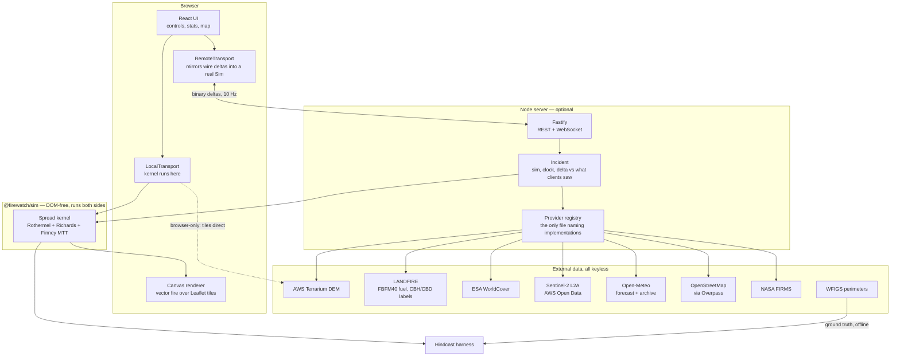
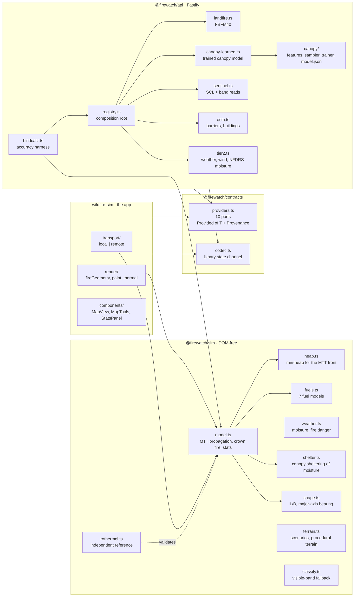
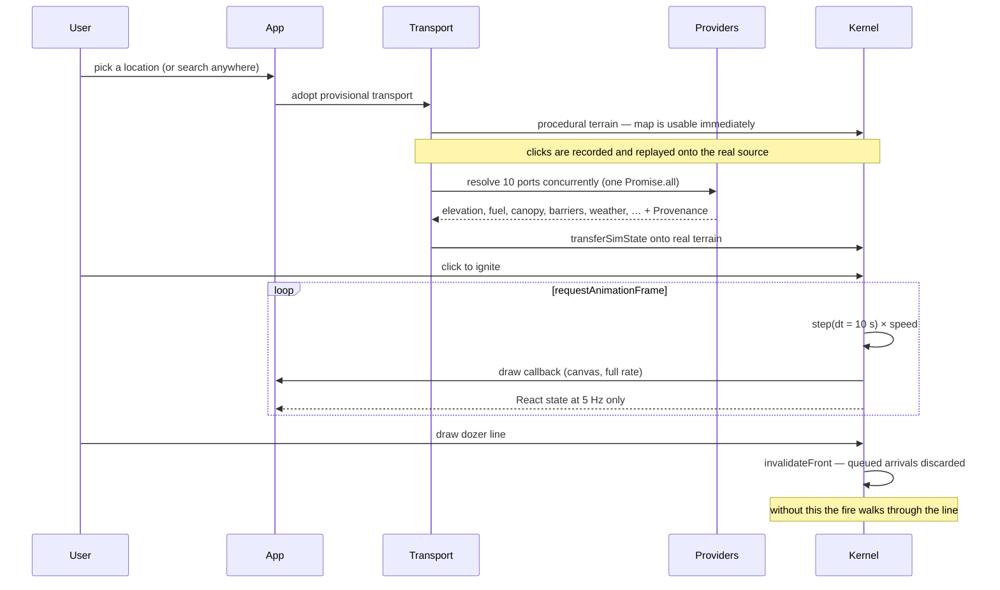

# Firewatch AI — Ember

**One document, every claim, with the number behind it.** If you have a question about
what this system does, what it is built on, or how well it works, the answer is here or
it is not a claim we make.

Everything below is measured from the code in this repository, not from a plan. Where a
number is bad, it is printed anyway — a system whose weaknesses are documented is worth
more than one whose strengths are asserted.

---

## Contents

 1. [What it is, in one paragraph](#1-what-it-is-in-one-paragraph)
 2. [Claims — what holds up and what does not](#2-claims--what-holds-up-and-what-does-not)
 3. [High-level architecture](#3-high-level-architecture)
 4. [Components](#4-components)
 5. [Application flow](#5-application-flow)
 6. [Physics — every equation, with its source](#6-physics--every-equation-with-its-source)
 7. [What the physics does not model at all](#7-what-the-physics-does-not-model-at-all)
 8. [Machine learning — exactly what, and exactly how well](#8-machine-learning--exactly-what-and-exactly-how-well)
 9. [Verification — three independent harnesses](#9-verification--three-independent-harnesses)
10. [Data sources — all ten ports, all real](#10-data-sources--all-ten-ports-all-real)
11. [Licensing and commercial terms](#11-licensing-and-commercial-terms)
12. [Performance, scale and cost](#12-performance-scale-and-cost)
13. [How this compares](#13-how-this-compares)
14. [Production readiness](#14-production-readiness)
15. [Repository context](#15-repository-context)
16. [Known defects — measured, characterised, and still there](#16-known-defects--measured-characterised-and-still-there)
17. [What we would build next, in order](#17-what-we-would-build-next-in-order)
18. [Running it](#18-running-it)
19. [Glossary](#19-glossary)

---

## 1. What it is, in one paragraph

An interactive wildfire spread simulator that runs **anywhere on earth**. Pick a point,
and terrain, fuel, canopy structure, weather, roads and building footprints are fetched
at runtime for that area; a physics kernel then spreads fire across a 400×400 cell grid
(~38 m cells over a 15 km domain) at up to 30 simulated minutes per real second. The
fire can be fought — dozer lines, retardant drops — and the consequences are modelled.
It runs either entirely in the browser or with the kernel server-side streaming binary
deltas at 10 Hz.

**The spread model is physics, not machine learning.** Rothermel (1972), Van Wagner
(1977), Richards (1990) and Finney (2002). Machine learning appears only upstream, in
perception: deriving canopy structure from satellite imagery.

---

## 2. Claims — what holds up and what does not

This section exists because the difference matters more than the technology.

| Claim | Verdict |
|---|---|
| "Physics-based spread model with learned perception inputs" | ✅ the strongest accurate framing available |
| "Canopy structure is predicted by a model trained on LANDFIRE, applied globally" | ✅ specific and checkable |
| "Fuel, water and canopy derive from ML-classified satellite products" | ✅ true across four ports |
| "All ten data sources are real — none returns invented data" | ✅ `GET /api/health` proves it |
| "Runs anywhere on earth" | ✅ every source is global or degrades to one that is |
| "Validated against real fires with published accuracy numbers" | ✅ see §9, and read the caveats |
| "Deep learning" / "neural network" | ❌ gradient-boosted trees, no neural network anywhere |
| "AI-powered wildfire prediction" | ❌ the prediction is a 1972 heat balance; the ML is upstream of it |
| "AI improves our accuracy" | ❌ **measured at −0.0004 Dice.** It does not |
| Any operational accuracy figure | ❌ every number in §9 is free-growth replay, not a forecast |

**The question that catches people:** *"So what does your model predict?"* The honest
answer — "canopy base height and bulk density per cell, which feed Van Wagner's crown
fire criteria" — is a good answer if you volunteer it and a bad moment if you implied the
forecast itself was learned.

**What is actually rare here** is not the ML. It is a fire model with a reproducible
accuracy harness that has repeatedly disproved its own authors, and a provenance system
that makes "mock data presented as live" a type error.

### What this is NOT for

Stated plainly because this is a fire product and the failure mode is someone acting on
it.

- **Not for evacuation, deployment or life-safety decisions.** Nothing here is validated,
  certified or reviewed to any operational standard.
- **Not a forecast.** Every number in the verification section is a *replay* of a fire
  whose outcome was already known, under weather that was already recorded. A forecast
  faces unknown weather and an unknown ignition.
- **Not calibrated for suppression.** The replay models a fire nobody fights. Real
  perimeters are the outcome of a fire service doing its job.
- **Not a substitute for FARSITE, FlamMap or a qualified analyst.** Those are the
  authoritative tools; see the comparison section for where this sits relative to them.
- **Not tested outside the fuels it models.** Seven simplified fuel classes cannot
  represent peat, permafrost, agricultural residue burning, or urban conflagration.

---

## 3. High-level architecture



**The transport seam is the design's core trick.** `RemoteTransport` mirrors wire deltas
into a real `Sim` object, so the renderer reads `sim.state` exactly as it would locally
and *cannot tell which transport it was handed*. A renderer that branched on transport
kind would defeat it.

---

## 4. Components



### Package layout

| Package | Path | Role |
|---|---|---|
| `@firewatch/sim` | `frontend/sim/` | the kernel. **DOM-free** — identical in browser and Node |
| `@firewatch/contracts` | `frontend/contracts/` | wire protocol, binary codec, provider ports. No runtime logic |
| `@firewatch/api` | `frontend/api/` | Fastify server, all provider implementations, harnesses |
| `wildfire-sim` | `frontend/Wildfire/` | UI, rendering, browser tile loading |

Node runs the backend TypeScript **directly** — no build step. That means type-stripping
only: no TS `enum`, `namespace`, parameter properties or decorators. `erasableSyntaxOnly`
makes `tsc` enforce it.

---

## 5. Application flow



**Why the two-phase terrain load exists:** real tiles take seconds. Showing a blank map
would swallow the user's first click. So both transports show procedural terrain
immediately and carry the user's fire across when the real data lands. Against a server
the provisional transport runs in `staging` mode — it accepts input but never steps,
because the server starts its own incident at t=0 and locally-accumulated growth would
visibly vanish at the handoff.

**Simulation state lives outside React.** `Sim` is a bag of typed arrays in a `useRef`,
mutated in place. The canvas is the real-time surface; the DOM is a read-out at 5 Hz.
Anything mutating the grid outside `step()` must bump `sim.revision` or the renderer will
skip the frame.

---

## 6. Physics — every equation, with its source

### 6.1 Surface spread

| Quantity | Form | Source |
|---|---|---|
| Head-fire rate | `R_head = baseRos · η_M · η_T · φ_slope · (1 + φ_w)` | kernel composition |
| Wind factor | `φ_w = C · U_mid^B · (β/β_op)^(−E)` — C, B, E from SAV; the packing term precomputed per fuel | **Rothermel (1972)** |
| Moisture damping | `η_M = 1 − 2.59r + 5.11r² − 3.52r³`, `r = min(M/M_x, 1)` — exactly 0 at extinction | **Rothermel (1972)** |
| Slope factor | `φ_slope = exp(0.0693 · φ)` — doubles per 10° upslope | standard field rule |
| Midflame wind | `U_mid = 0.4 · U_10m` | conventional adjustment for unsheltered fuels |
| Reaction intensity (reference) | `I_R = Γ' · w_n · h · η_M · η_s` | **Rothermel (1972)** |

### 6.2 Direction — the elliptical template

| Quantity | Form | Source |
|---|---|---|
| Length-to-breadth | `L/B = 0.936e^(0.2566U) + 0.461e^(−0.1548U) − 0.397`, U in mi/h midflame, capped at 8 | **Anderson (1983)** |
| Eccentricity | `e = √(1 − 1/(L/B)²)` | ellipse geometry |
| Directional rate | `R(θ) = R_head · (1 − e)/(1 − e·cos θ)` | **Richards (1990)** — the formulation under FARSITE, FlamMap, Prometheus, Cell2Fire |

θ = 0 gives the head, θ = 180° gives `(1−e)/(1+e)` (the backing edge), θ = 90° gives
`(1−e)` (the flank, the semi-latus rectum). Integrating recovers L/B by construction.
Calm air gives L/B = 1 exactly, hence e = 0 and a circle.

### 6.3 Propagation — minimum travel time

| Quantity | Form | Source |
|---|---|---|
| Arrival time | `t_j = min over burning neighbours i of [ t_i + d_ij / R(θ_ij) ]` | **Finney (2002)** Minimum Travel Time |
| Algorithm | **Dijkstra's shortest path** over the cell graph, binary min-heap with lazy deletion | Dijkstra (1959) |
| Underlying principle | the fire front as the envelope of elliptical wavelets | **Huygens' principle** |

Travel time is a real number, so arrival is not quantised to `dt`. A cell settled inside
a step immediately relaxes its own links, so a chain can ignite within one step.

### 6.4 Crown fire

| Quantity | Form | Source |
|---|---|---|
| Fireline intensity | `I = H · w · R` | **Byram (1959)** |
| Crown initiation | `I_0 = [0.010 · CBH · (460 + 25.9·M_f)]^1.5` | **Van Wagner (1977)** |
| Active crowning | `R ≥ 3.0 / CBD` | **Van Wagner (1977)** |
| Apparent temperature | `T = T_amb + 1050·tanh(I/I_ref)` | thermal view, ARCHITECTURE.md §4 |

Both criteria must hold for an active crown fire; initiation alone gives passive
crowning (torching), which matters mainly because it throws embers.

### 6.5 Fuel moisture

| Quantity | Form | Source |
|---|---|---|
| Equilibrium moisture | piecewise in RH: `21.06 + 0.005565·H² − 0.00035·H·T − 0.4832·H` above 50% RH | **Simard (1968)** |
| 1-hour timelag | `M ← target + (M − target)·e^(−1/τ)`, τ = 1 h drying, 0.3 h wetting | **NFDRS** |
| Rain saturation | `target = min(35, 10 + 12·precip_mm)` | NFDRS convention |
| Canopy sheltering | `RH_eff = RH + 12·cover` | **Rothermel (1983)** shading corrections (+3 to +5 points under ≥50% canopy) |

### 6.6 Other terms

| Quantity | Form | Source |
|---|---|---|
| Burn severity | `dNBR = NBR_pre − NBR_post`, `NBR = (NIR − SWIR2)/(NIR + SWIR2)` | Key & Benson |
| Fire danger | Chandler Burning Index from T and RH | standard scale |
| Barriers | `blockFrac[i·8 + d]` scales flux across each of 8 edges; capped below 1 | ARCHITECTURE.md §5 sub-cell treatment |
| Accuracy score | `Dice = 2·\|A∩B\| / (\|A\| + \|B\|)` | Sørensen–Dice |
| Reachability | flood fill over fuel-connected cells | first-passage bound |

### 6.7 Fuels

Seven simplified models after Anderson's 13. **Moisture of extinction is published
Anderson (1982); `depth`, `sav` and `bulkDensity` are invented and are the largest known
weakness.**

| Fuel | baseRos m/s | load kg/m² | depth m | SAV | M_x % | Anderson analogue |
|---|---|---|---|---|---|---|
| Grass / annual | 0.062 | 0.8 | 0.3 | 3500 | **12** | FM1 short grass |
| Chaparral / shrub | 0.034 | 3.2 | 1.3 | 1500 | **20** | FM4 chaparral |
| Timber / conifer | 0.013 | 5.5 | 0.65 | 1700 | **25** | FM10 timber + understorey |
| Agriculture | 0.021 | 1.1 | 0.35 | 2000 | **12** | FM1-like cured herbaceous |
| Urban / WUI | 0.007 | 2.4 | 0.6 | 1200 | 22 | none — assumed |
| Water, Rock/barren | 0 | 0 | — | — | — | unburnable |

> **FM10 rather than FM8 for timber.** FM8's 30% is genuinely published, but it is the
> one Anderson model whose extinction humidity cannot be reached from open-air
> equilibrium moisture — Simard saturates near 27%. Choosing FM8 for a generic tree-cover
> class is what made timber unstoppable.

---

## 7. What the physics does not model at all

Distinct from the defects section: these are not errors, they are absences. Each is a
real mechanism in real fires that this model contains no representation of.

| Absent | Consequence |
|---|---|
| **Fire–atmosphere coupling** | no plume dynamics, no indraft, no column collapse. A real plume modifies the wind that drives the fire; here wind is an input only |
| **Long-range spotting** | embers are thrown, but range is a simple function of wind and intensity, unvalidated against observation. Real spotting jumps kilometres and starts fires ahead of the front |
| **Diurnal inversion layers** | fires in mountain terrain behave very differently under a stable nocturnal inversion. Nothing here knows about atmospheric stability |
| **Fuel moisture in classes above 1-hour** | 10-h, 100-h and 1000-h fuels, and live fuel moisture, are not tracked. Only the fine fuel that carries the flaming front |
| **Seasonal plant physiology** | foliar moisture is fixed at 100%, and it enters Van Wagner's `I_0` directly |
| **Multi-size-class fuel beds** | each fuel is a single load at a single surface-area-to-volume ratio. Real Anderson and Scott & Burgan models are multi-class, which is why the benchmark reference is only valid for the fuels it is applied to here |
| **Terrain-following flame geometry** | the model is 2D. Flame tilt, canyon channelling and lee-slope eddies are absent |
| **Suppression as a resource problem** | crews, aircraft, water and time are one scalar "suppression effort" |
| **Smoke** | not modelled, and smoke extent must never be substituted for fire extent |

---

## 8. Machine learning — exactly what, and exactly how well

### 8.1 Our own model: `landfire-gbt-canopy`

| | |
|---|---|
| Problem | canopy base height, bulk density, cover and height per 30 m cell |
| Why it matters | CBH and CBD are the *entire* input to Van Wagner's crown criteria |
| Algorithm | scikit-learn `GradientBoostingRegressor` — 250 trees, depth 3, lr 0.06, subsample 0.8, one model per target |
| Labels | **LANDFIRE LF2023** CBH / CBD / CC / CH, 30 m, CONUS |
| Features (16) | 6 Sentinel-2 bands, NDVI, NBR, NDWI, elevation, slope, northness, eastness, local NIR texture, land-cover class, abs latitude |
| Training set | 5,499 cells across **13 CONUS regions** |
| Validation | `GroupKFold` by region — **never random** |
| Serving | exported to `model.json` (415 kB), walked in plain TypeScript at **11 µs/cell**. No runtime ML dependency |
| Frameworks | numpy 2.5.3, scikit-learn 1.9.1. **No PyTorch, no MPS, no neural network** |

**Held-out performance, whole regions withheld:**

| Target | Model MAE | Assumed-constant MAE | Model RMSE | RMSE gain |
|---|---|---|---|---|
| cover | **0.140** | 0.205 | 0.178 | 28.3% |
| height | **4.65 m** | 5.63 m | 5.93 | 17.8% |
| CBH | **2.54 m** | 3.96 m | 3.58 | 13.7% |
| CBD | 0.048 | 0.051 | 0.064 | **4.0%** |

**Why CBD barely beats a constant — and why a bigger model will not fix it.** Optical
reflectance sees the *top* of a canopy; bulk density is a property of its interior. That
is a sensor limit. Spaceborne lidar (GEDI L2B vertical profiles) is the fix; a CNN is
not. And CBD is the one that matters most, because active crowning is `R ≥ 3.0/CBD`.

**Why a model and not just the raster.** LANDFIRE stops at the US border and this app
simulates anywhere; the bookmarked scenarios are Armenian. Inside CONUS, reading LANDFIRE
directly would be strictly better and that provider does not exist yet.

### 8.2 Three rules that keep it honest

1. **`features.ts` is shared by the training sampler and the inference provider.**
   Train/serve skew is invisible — the held-out score stays good while production
   degrades. `model.json` carries the feature list it was trained with, and the provider
   throws on drift rather than silently reinterpreting columns.
2. **CV is blocked by region.** Two 30 m pixels 100 m apart are near-duplicates; a random
   split scores interpolation inside a forest the model has already seen.
3. **`npm run canopy:check` proves the TypeScript tree walk reproduces scikit-learn.** Two
   implementations of one tree walk, and a wrong one — off-by-one child index, `<` for
   `<=`, a lost learning rate — produces entirely plausible numbers. It agrees to
   **8×10⁻⁹** on three targets; one row in 120 differs on `height` because float32 lands
   the far side of a split.

### 8.3 ML we consume rather than train

ESA WorldCover, Sentinel-2's Scene Classification Layer, and LANDFIRE's own layers are
all classifier or regression-tree products over satellite stacks. So *"our fuel, water and
canopy inputs derive from machine-learned satellite products"* is true across four ports
independently of our own training.

### 8.4 The measured null result

**Learned canopy versus per-class constants, over the same fuel map, unsuppressed:**

| Anderson Bridge | Pineland Rd | Hwy 82 | Ballard | 113 Incident | mean |
|---|---|---|---|---|---|
| −0.006 | +0.003 | ≈0 | ≈0 | ≈0 | **≈ 0.000** |

Canopy structure is **not** the binding constraint on this model's accuracy. Recorded so
nobody spends weeks on GEDI, a CNN or PyTorch for canopy before that measurement moves —
the link from canopy accuracy to fire accuracy is currently unmeasurable, which makes any
improvement to it unfalsifiable.

### 8.5 What ML is deliberately *not* used for

**Spread.** A model trained on the residual between predicted and observed perimeters is
where most "AI wildfire" products live. With five fires it would memorise them, and it
would destroy the one property that makes a physics kernel defensible, stated at
`ARCHITECTURE.md:18`:

> *"Vision has abundant labels. Fire physics has to extrapolate to conditions no training
> set contains."*

---

## 9. Verification — three independent harnesses

### 9.1 Kernel physics tests

`npm test` — Node's built-in runner, no dependency, TypeScript stripped natively.

**43 tests, 43 pass, 0 fail, 0 todo.**

| Group | Asserts |
|---|---|
| isotropy | axis vs diagonal within 10%, no compass preference, averaged over 8 seeds |
| front speed | advances at the kernel's own nominal ROS |
| wind | elongates downwind, holds the backing edge, matches Rothermel's wind response |
| slope | runs uphill, matches the 10°-per-doubling rule |
| fuel & moisture | extinction halts spread, water never burns, per-fuel ordering |
| determinism | same seed → identical grid |
| bookkeeping | incremental stats match a full recount |
| crown fire | Van Wagner thresholds, sharp transition, needs CBD as well as intensity |
| Rothermel agreement | calm-wind within a factor of two, wind response across the range |
| control lines | **a dozer line drawn against the front stops it** |
| shape | L/B and bearing recovered from ellipses of known orientation; emergent L/B reaches Anderson |
| heap | pops in key order against a sorted array, 5,000 random keys past the growth point |

Two tests were `todo` for this file's whole life — the front advancing at 4.45× nominal,
and calm-wind spread disagreeing with Rothermel by 5.6×. Both were the same defect, both
closed **on their own** when MTT landed, and neither was ever tuned into passing.

### 9.2 Benchmark against Rothermel

`npm run bench` — compares the kernel against an independent Rothermel (1972)
implementation, validated to **4% against published BehavePlus output for FM1**.

| fuel | wind km/h | Rothermel m/min | nominal | emergent | nom/roth | **emrg/nom** |
|---|---|---|---|---|---|---|
| Grass | 0 | 1.51 | 1.94 | 1.84 | 1.28× | **0.95×** |
| Grass | 15 | 14.28 | 18.34 | 18.25 | 1.28× | **0.99×** |
| Grass | 40 | 98.86 | 126.99 | 126.27 | 1.28× | **0.99×** |
| Chaparral | 40 | 123.68 | 50.78 | 50.66 | 0.41× | **1.00×** |
| Timber | 40 | 58.95 | 13.08 | 13.05 | 0.22× | **1.00×** |
| Agriculture | 40 | 41.21 | 27.58 | 27.56 | 0.67× | **0.99×** |

**`emergent / nominal` is 0.94–1.00× on every wind case** — it was 4.45× before MTT. The
front now advances at the rate the model reports. Two outliers are measurement, not
kernel: 1.09× on a calm run the bench flags as short, and 0.71× on a 30° slope where an
equal-area radius averages a fast upslope head with crawling flanks.

**`nominal / Rothermel` (0.22–1.28×) is not evidence that `baseRos` is wrong.** Timber's
nominal 0.49 m/min matches published BehavePlus FM8's 0.5. It is the single-particle
reference over-predicting multi-class fuels, plus bed parameters that are invented.

### 9.3 Hindcast — the only end-to-end accuracy number

`npm run hindcast` replays real fires against their mapped perimeters. Ground truth is the
**WFIGS interagency perimeter** — an authoritative polygon for one named incident with a
discovery time — plus Open-Meteo's archive for the weather as it actually was.

**Current results, unsuppressed, on operational FBFM40 fuel:**

| Fire | Strategy | Window | Truth | Modelled | Ratio | **Dice** | Equal-area circle | Gap | Recall | Precision |
|---|---|---|---|---|---|---|---|---|---|---|
| Anderson Bridge | **100% monitored** | 191 h | 6,972 ha | 47,546 | 6.87× | 0.253 | 0.332 | −0.079 | 99% | 14% |
| Pineland Rd | 100% suppressed | 100 h | 12,962 | 51,165 | 3.96× | 0.393 | 0.403 | −0.010 | 97% | 24% |
| Hwy 82 | 100% suppressed | 239 h | 9,073 | 66,150 | 7.32× | 0.239 | 0.243 | −0.004 | 99% | 13% |
| Ballard | 100% suppressed | 41 h | 7,464 | 39,558 | 5.33× | 0.308 | 0.321 | −0.013 | 97% | 18% |
| 113 Incident | 100% suppressed | 22 h | 2,074 | 2,937 | 1.42× | 0.324 | 0.795 | −0.472 | 39% | 27% |

**The model currently loses to an equal-area circle.** That is the honest headline. The
circle is the null model: a disc at the same ignition point with the same area the model
produced. Anything the physics is worth shows up as the gap, and the gap is negative.

**But the shape-through-time trace says the physics works and duration ruins it:**

| Fire | Early | Truth | Final |
|---|---|---|---|
| Anderson Bridge | **L/B 3.74 @ 140°**, 10.6 kha at hour 10 | L/B 2.17 @ **140°**, 6.97 kha | L/B 1.02, 47.5 kha at 191 h |
| Ballard | L/B 3.64 @ 133° at hour 2 | L/B 2.56 @ 44° | L/B 1.22 at 41 h |
| Pineland Rd | L/B 2.36 at hour 5 | L/B 2.42 | L/B 1.12 at 100 h |

Anderson Bridge at hour 10 has **one degree of bearing error** and 1.5× on area. Shape,
bearing and area are all approximately right early; by hour 191 the fire has filled its
fuel-connected region and has no shape at all.

**Six candidate causes have been tested and eliminated:** spread rate, duration,
reachability, fuel classification, barriers, and suppression (swept 0–100% flat from hour
zero, which bounds what it could ever explain — it moves area by 4–25% and makes Dice
*worse* on most fires).

#### Rules the harness enforces on itself

- **Ground truth is a perimeter, not dNBR.** An earlier version differenced two Sentinel-2
  scenes, but revisit and cloud force the pair tens of days apart, so the "scar" was every
  fire in the region that season scored against a simulation of one.
- **The rasterisation self-check.** A polygon's rasterised area must land within 0.8–1.25×
  of the acreage WFIGS reports, or the run is skipped. Two of the first four disagreed by
  100×, and a wrong rasterisation yields a Dice score that looks exactly like a measurement.
- **The replay ends at the polygon's own timestamp**, not at containment. Getting this
  wrong gave Cypress Creek 313 h against a polygon mapped at 65 h.
- **Suppression strategy is reported with every score.** A free-growth replay scored
  against a fought fire is partly measuring the fire service. Only 1 of 24 WFIGS fires was
  monitored rather than suppressed.
- **Verdicts come from the unfitted run, never the best of the sweep.** Taking the maximum
  gap over five suppression levels announced "physics BEATS a circle" on gaps of +0.000
  and +0.002 — pure selection.

### 9.4 How reproducible are these numbers?

Honestly: **the kernel numbers are exactly reproducible and the hindcast numbers are
not.** Anyone quoting §9.3 needs to know why.

| Harness | Reproducible? | Why |
|---|---|---|
| kernel tests | ✅ exactly | seeded RNG, synthetic terrain, no network. `createSim(terrain, seed)` exists so tests can pin it |
| benchmark | ✅ exactly | same |
| canopy parity | ✅ exactly | fixture committed alongside the model |
| canopy held-out metrics | ✅ from the committed table | `training.jsonl` is committed; re-running the sampler hits live Sentinel-2 and will draw different scenes |
| **hindcast** | ❌ **not** | see below |

Three independent reasons the hindcast drifts:

1. **WFIGS is a *year-to-date* service.** The endpoint is
   `WFIGS_Interagency_Perimeters_YearToDate`, so the set of fires between 5k and 60k acres
   grows through the season and perimeters are revised in place. Run it a month from now
   and you get a partly different set of fires.
2. **Perimeters and their attributes are edited after the fact.** Acreage, containment
   times and geometry all change; the harness already skips records whose rasterised area
   disagrees with their own reported acreage by more than 25%, which caught four such
   records.
3. **Sentinel-2 scene selection is "least cloudy recent"**, so fuel, canopy and burn
   history depend on when you ask.

**What this means in practice:** treat §9.3 as a measurement taken on a stated date
against a stated fire set, not as a benchmark score. Comparisons across code changes are
valid only when run back to back, which is how every before/after pair in this document
was produced.

### 9.5 Other harnesses

| Command | Checks |
|---|---|
| `npm run smoke` | Playwright drives every UI control in headless Chromium, fails on any console error. **50 fps** with a large fire |
| `npm run smoke:api` | boots the server, decodes binary frames, mirrors them client-side. 24 assertions. ~1–3 kB/frame against 132 kB for a full grid |
| `npm run watercheck` | the fuel classifier against six water bodies chosen to break a colour-based one |
| `npm run barriercheck` | OSM barrier geometry, and that the kernel honours the per-edge ordering |
| `npm run canopy:check` | TypeScript inference reproduces scikit-learn to 8×10⁻⁹ |

---

## 10. Data sources — all ten ports, all real

Every provider returns `Provided<T>` = data **plus** `Provenance` (`measured` / `derived`
/ `synthetic`, native resolution, observation time, coverage, note). *"Mock data presented
as live" is meant to be a type error.*

| Port | Implementation | Source | Resolution | Keyless |
|---|---|---|---|---|
| elevation | `terrarium-dem` | AWS Terrarium terrain tiles | ~30 m | ✅ |
| fuel | `landfire-fbfm40` → `esa-worldcover` → `s2cloudless-visible-band-fuel` | LANDFIRE Scott & Burgan 40-model (CONUS); ESA WorldCover v200 (global) | 30 m / 10 m | ✅ |
| canopy | `landfire-gbt-canopy` | trained model over Sentinel-2 + terrain | 30 m | ✅ |
| barriers | `osm-barriers` | OpenStreetMap roads + watercourses via Overpass | per-edge | ✅ |
| burn history | `sentinel2-dnbr` | Sentinel-2 L2A scene pair, AWS Open Data | 20 m | ✅ |
| weather | `nws-gridpoint` → `open-meteo` | NWS gridpoint forecast (US, public domain); Open-Meteo elsewhere | ~2.5 km | ✅ |
| wind field | `open-meteo-windfield` | spatial anomaly, not absolute | grid cell | ✅ |
| fuel moisture | `nfdrs-1h-timelag` | Simard EMC + 1-h timelag over 7 d history | per-cell | ✅ |
| observer | `firms-perimeter` | NASA FIRMS VIIRS/MODIS | 375 m | ✅ |
| values at risk | `osm-buildings` | counted OSM footprints, not a per-hectare estimate | per building | ✅ |

Also used: **WFIGS interagency perimeters** (ground truth, offline only) and **Sentinel-2
cloudless** from EOX (basemap and last-resort fuel classifier, CC-BY-4.0).

**Offline mode** swaps every one for a procedural or null implementation, so the whole
system runs with no network and the header chip says so.

### Things learned the hard way about these sources

- **Water comes from Sentinel-2's Scene Classification Layer, not from colour.** The
  visible-band classifier called the Great Salt Lake 57% cropland and the Rio Negro 44%
  urban, so lakes burned. RGB cannot do this job: water is turquoise, black, pink or brown
  depending on where you are, and only the NIR is consistent.
- **Sentinel-2 band DNs carry the scale but NOT the advertised offset.** Applying the
  offset looks like a bug fix and is a regression: deep water reads ρ ≈ 0.01 with scale
  alone and an impossible ρ ≈ −0.09 with it. A normalised difference hides the error.
- **No-data must become NaN, never 0.** A granule-edge 0 in one band makes NBR return
  exactly ±1, which differences into a burn scar invented out of missing data.
- **FIRMS needs `node:https`, not `fetch`.** Node's undici reliably fails against that
  host at its fixed 10 s connect limit while curl connects in under 200 ms.
- **Overpass gets its own 60 s budget**, separate from the 15 s general timeout: every
  building in a dense 15 km box is 20–40 s of server-side work, and 15 s silently
  truncated Athens into a per-hectare estimate.

---

## 11. Licensing and commercial terms

**This section is the largest untested commercial risk in the project and nothing in the
repository documented it before now.** Nothing here is legal advice; every row needs
confirming by counsel before revenue.

| Source | Believed terms | Commercial risk |
|---|---|---|
| **LANDFIRE** (FBFM40, CBH/CBD) | US federal work — public domain | 🟢 low |
| **WFIGS** perimeters | US federal — public domain | 🟢 low |
| **NWS** `api.weather.gov` | US federal — public domain, free for commercial use | 🟢 low, requires a `User-Agent` by policy |
| **NASA FIRMS** | US federal — public domain, attribution requested | 🟢 low |
| **Sentinel-2 / Copernicus** | free and open, attribution required | 🟢 low |
| **ESA WorldCover v200** | CC-BY-4.0 — attribution required | 🟢 low, attribution mandatory |
| **Sentinel-2 cloudless** (EOX) | CC-BY-4.0 — attribution required | 🟢 low, attribution mandatory |
| **AWS Terrarium terrain tiles** | open data, derived from public DEMs; attribution expected | 🟢 low |
| **OpenStreetMap** (barriers, buildings) | **ODbL 1.0** | 🟠 **share-alike on a derived database.** Counting footprints per cell may constitute one. Needs a considered position, not an assumption |
| **Open-Meteo** | free tier is **non-commercial**; data CC-BY-4.0 | 🟠 **reduced, not removed.** No longer the forecast source in the US; still used for the drought clock, the hindcast archive, and place-name search |
| **OpenTopoMap** tiles | CC-BY-SA | 🟠 share-alike; also a courtesy tile server, not a CDN |
| ~~Esri World Imagery~~ | ~~restricted without a licence~~ | ✅ **removed.** Replaced by Sentinel-2 cloudless in all three code paths |

### What was fixed, and what remains

**Esri is gone.** It was the basemap, the server-side fuel classifier's imagery and
the browser-side classifier's imagery. All three now read **Sentinel-2 cloudless**
(EOX, CC-BY-4.0), which is free for commercial use with attribution, keyless, and
global. An annual cloudless composite is arguably better for land-cover
classification than an arbitrary recent scene, having no seasonal or cloud
variation to classify around.

> **Cost of that swap, measured rather than assumed.** The visible-band
> classifier's thresholds were tuned against *Esri* band statistics, so it reads
> the new source slightly worse: at Angelina National Forest it now calls the
> domain 64% Agriculture where Esri gave 52% Cropland — the same failure, a little
> larger. It was already unusable outside Armenia, which is why WorldCover
> replaced it, and it is now the **third** fallback behind FBFM40 and WorldCover.
> Re-tuning against the new source is a `npm run calibrate` job and is not done.
> Water and snow are unaffected: they come from Sentinel-2's Scene Classification
> Layer, and `npm run watercheck` still classifies all six sites from Sentinel-2.

**Open-Meteo is reduced, not eliminated.** `api.weather.gov` is now the forecast
provider ahead of it, so in the United States — which is where every hindcast fire
is — the forecast comes from a public-domain federal source. Outside the US the
`/points` lookup 404s and the chain falls back, with `degradedFrom` recording it.
Three uses remain and none has an NWS equivalent:

| Remaining use | Why NWS cannot cover it | Exit |
|---|---|---|
| drought clock (days since rain) | NWS publishes forecasts, not archives. It is attempted and **degrades to the scenario preset**, so a US incident can run with zero Open-Meteo calls | NOAA NCEI, or self-host |
| hindcast archive (historical hourly) | no NWS archive API | self-host, or ERA5 direct from Copernicus |
| place-name search | not a weather service | Nominatim (ODbL), Photon, or GeoNames |

**The two complete exits**, either of which removes the term entirely: **self-host
Open-Meteo** — it is open source and the underlying ERA5/GFS/DWD data is public —
or **buy their commercial plan**. The provider-port design means a swap is one line
in `registry.ts`, which is how NWS was added.

**Also relevant, and already recorded by the team:** ELMFIRE is AGPLv3 plus Commons Clause
(`docs/concurrent-analysis/09-observation-baseline/external-models-cypress-creek.md`), and
Ultralytics YOLO is AGPL-3.0 — both matter if `backend/vision/` ever ships.

---

## 12. Performance, scale and cost

| Measure | Value | Source |
|---|---|---|
| Grid | 400 × 400 = 160,000 cells, ~38 m over a 15 km domain | `TARGET_COLS` in `terrain.ts` |
| Simulation speed | up to 30 simulated minutes per real second | speed control |
| Kernel step | fixed `DT = 10` simulated seconds | `model.ts` |
| Render | **50 fps** with a large fire, geometry rebuilt at ~20 Hz, DOM at 5 Hz | `npm run smoke` |
| Wire traffic | **~1–3 kB per frame** at 10 Hz, against 132 kB for a full grid | `npm run smoke:api` |
| Incident creation | ~0.5 s offline, ~7 s live (dominated by concurrent tile and COG reads) | `smoke:api` |
| Canopy inference | **11 µs/cell**, ~1.8 s for a full grid | `npm run canopy:check` |
| Canopy model size | 415 kB JSON, no runtime ML dependency | `model.json` |
| Concurrent incidents | `MAX_INCIDENTS` = 32, idle reaped after 60 s | `config.ts` |
| Marginal data cost | **zero** — every source is keyless and free at current volume | §10 |
| Infrastructure | one Node process; no GPU, no database, no queue | — |

**The cost story is a genuine strength.** There is no per-query data bill, no GPU, and no
database. The binding cost is CPU for the kernel and disk for the tile cache. The
trade-off is that everything lives in memory and dies with the process.

---

## 13. How this compares

Positioned honestly, because overstating it invites comparison against the wrong
competitors.

| | What it is | Where it beats us | Where we differ |
|---|---|---|---|
| **FARSITE / FlamMap** (USFS) | the authoritative operational tools, free, desktop | validated physics, multi-size-class fuels, decades of field use, trusted in court | they need prepared LANDFIRE landscape files and a trained analyst; we run anywhere on earth from a click, in a browser |
| **ELMFIRE** | open, fast, ensemble-capable | proper operational model | AGPLv3 + Commons Clause; needs a build toolchain we could not stand up |
| **Cell2Fire** | research C++ implementation | multi-class Rothermel done properly | research code, not a product |
| **Technosylva** | commercial, operational, used by utilities | validated, supported, insured | closed, expensive, US-centric, no self-serve |
| **Pano AI, Alchera** | camera-based detection | genuinely excellent at *detecting* fires | they detect; they do not predict spread |

**What is actually differentiated here:**

1. **Zero setup, anywhere on earth.** No landscape file, no data preparation, no install.
   Click a point in Armenia and it simulates.
2. **Provenance as a type.** Every input carries where it came from and how good it is, and
   the UI surfaces it. "Mock data presented as live" is a compile error.
3. **An accuracy harness that argues with us.** Six candidate explanations tested and
   eliminated; four changes kept that made the headline numbers worse because they were
   correct.

**What is not differentiated:** the physics. It is a faithful but simplified
implementation of published work, with invented bed parameters, and FARSITE does it better.

---

## 14. Production readiness

| | State |
|---|---|
| Authentication | ❌ none |
| Authorisation | ❌ none — any caller can create, drive or delete any incident by id |
| Persistence | ❌ none. Incidents are an in-memory `Map`; a restart loses everything |
| CORS | 🟠 deliberately permissive, for a local dev UI on another port |
| Rate limiting | ❌ none. `MAX_INCIDENTS` = 32 is the only backstop, and Overpass/COG reads are triggered by user-supplied coordinates |
| Deployment | ❌ no container, no CI deploy, no infrastructure |
| Secrets | 🟢 none to leak — every source is keyless |
| CI | 🟢 typecheck, kernel tests and smoke tests run on GitHub Actions |
| Linting | ❌ no linter. `strict`, `noUnusedLocals` and `noUnusedParameters` are the enforcement |
| Observability | ❌ console logging only |
| Liability position | ❌ undecided, and §2's "not for life-safety decisions" is not a substitute for one |

**Honest summary:** this is a well-tested simulation engine with a validation harness. It
is not a service. The gap is auth, persistence, deployment and a liability position — none
of which is physics, and none of which has been started.

---

## 15. Repository context

This document describes `frontend/`. Three other areas belong to other workstreams and are
untouched by it:

| Path | What |
|---|---|
| `backend/api/` | endpoints, request validation, application logic — scaffold |
| `backend/llm/` | prompts, model integrations, evaluations — scaffold |
| `backend/vision/` | **fire observation research** — offline reproducible RGB/thermal rules (M0), with a documented path to learned detection. This is where PyTorch belongs |
| `contracts/` (repo root) | shared API schemas and example payloads — scaffold, distinct from `frontend/contracts/` |
| `docs/concurrent-analysis/` | market, product and dataset research, including the external-model and dataset licensing audits |
| `docs/infrastructure-spec/` | proposed service catalogue and operations |

`AGENTS.md` at the repository root is the cross-team guide and the authoritative decision
log.

---

## 16. Known defects — measured, characterised, and still there

| Defect | Magnitude | Status |
|---|---|---|
| **Fires never stop** | sheltered timber carries 189/191 replay hours | **Largest open defect.** Shape decays from L/B 3.74 at hour 10 to 1.02 at 191 h. `SHELTER_RH_GAIN` was deliberately not raised to force a pause |
| `depth`, `sav`, `bulkDensity` invented | timber depth 0.65 m vs FM8's published **0.061** | Needs multi-size-class Rothermel before real values can be used. **The highest-value work outstanding** |
| Elongation reaches ~half of Anderson's L/B | flank runs 4–10× nominal, head 0.5–1.0× | Lattice, not the ellipse: isotropic overshoot (~2.8×) composes with diagonal leakage (3.2×) |
| Loses to an equal-area circle | gap −0.004 to −0.472 | A circle gets *stronger* as the model's area approaches truth, so closing the area error raised the bar |
| CBD barely beats a constant | 4% RMSE gain | Sensor limit, not model limit. Needs lidar |
| Barriers move Dice by < 0.003 | 30,000–145,000 blocked edges | Correct per the sub-cell design: `blockFrac` peaks near 0.6, so roads do not act as firebreaks at 30–80 m |
| Foliar moisture fixed at 100% | enters Van Wagner's `I_0` directly | Nothing tracks seasonal plant physiology |
| `MAX_LB = 8`, `MAX_WIND_FACTOR = 1000` | caps on unbounded formulas | Anderson's fit and Rothermel's `φ_w` diverge outside their calibration range |
| Slope is per-direction | departs from FARSITE's wind-slope vector | The one deliberate departure from Richards |
| **No auth, no persistence, no deployment** | incidents are an in-memory `Map` | Untouched. A restart loses everything |
| Esri imagery licensing | commercial terms unexamined | Must be resolved before any commercial use |

### A pattern worth knowing about this codebase

**The hindcast numbers got worse three times on purpose, and must not be optimised back.**
Correct moisture, published `M_x`, Rothermel's damping polynomial and operational FBFM40
fuel each *cost* accuracy — because each removed an error that had been cancelling
another. Two cancelling errors that produce a good number are worse than one visible
error, because the good number stops anyone looking.

Errors that were only found because an external reference disagreed:

- the wind term reached 3.6× at 40 km/h where Rothermel reaches 65× — under-predicting
  the dangerous case by ~20×;
- the arrival draw advanced the front at 4.45× the rate the model reported;
- the moisture damping curve was invented and agreed with Rothermel only near `r ≈ 0.4`,
  which is exactly where the old `M_x` values put the tests;
- the test harness held its own stale copy of that curve and reported a 1.88× error that
  existed nowhere but the harness.

---

## 17. What we would build next, in order

1. **Multi-size-class Rothermel + Scott & Burgan bed parameters.** No ML. Published
   numbers. Fixes the depth-0.65-against-0.061 problem, makes the benchmark reference
   valid, and unlocks the FBFM40 fuel data already being read.
2. **Whatever stops a real fire.** Four of five replays are still burning when the window
   ends. This is the binding constraint on shape.
3. **A LANDFIRE-direct fuel and canopy provider for CONUS.** Reading beats predicting
   where the raster exists; the trained model becomes the fallback for everywhere else.
4. **More monitored fires.** Every accuracy claim rests on 1 genuinely free-burning fire
   out of 24 WFIGS candidates.
5. **Product fundamentals:** auth, persistence, deployment, imagery licensing.
6. **Only then** `backend/vision/` — live drone and ground frames, where no published
   raster can exist because the frame is 200 ms old, and where PyTorch genuinely is the
   right tool.

---

## 18. Running it

```bash
npm install                 # in frontend/ — the workspace root

npm run dev                 # UI + API together
npm run dev:web             # browser-only sim, Vite on :5173
npm run dev:api             # Fastify on :8787, live data
FIREWATCH_MODE=offline npm run dev:api     # fully procedural, no network

npm run typecheck           # every workspace
npm test                    # 43 kernel physics tests
npm run bench --workspace=@firewatch/sim   # vs Rothermel
npm run smoke               # UI, headless Chromium (needs dev:web)
npm run smoke:api           # server + binary stream
npm run hindcast --workspace=@firewatch/api           # accuracy vs real fires
npm run canopy:check --workspace=@firewatch/api       # TS inference == sklearn
```

### Where to read more

| Document | Covers |
|---|---|
| `frontend/APP-FLOW.md` | end-to-end flow with every equation and its source line |
| `frontend/Wildfire/ARCHITECTURE.md` | the proposed target design — **read as direction, not description** |
| `frontend/Wildfire/README.md` | the model and data sources, narrative |
| `frontend/api/README.md` | provider ports, protocol, diagnostics |

---

---

## 19. Glossary

Terms used above without explanation, because a reader outside fire science should not
have to guess.

| Term | Meaning |
|---|---|
| **CBH** | canopy base height, m — how far the flames must reach to enter the crowns |
| **CBD** | canopy bulk density, kg/m³ — how densely packed the crown fuel is. Decides whether a crown fire sustains itself |
| **M_x / mx** | moisture of extinction, % — above this a fuel will not carry fire at all |
| **SAV / σ** | surface-area-to-volume ratio, ft²/ft³ — fine fuels have high SAV and ignite readily |
| **1-hour fuel** | dead fine fuel that equilibrates with the air in about an hour. It is what carries the flaming front |
| **fine load vs total load** | the 1-hour fraction versus all size classes. Applying the ignition heat sink to total load makes heavy fuels non-ignitable — a real bug |
| **ROS** | rate of spread, m/min or m/s |
| **head / flank / backing** | the downwind edge, the sides, and the upwind edge of a fire |
| **L/B** | length-to-breadth ratio — how elongated a fire is. 1 is a circle |
| **FBFM40** | the Scott & Burgan (2005) 40 Fire Behavior Fuel Models, the US operational set |
| **FM1, FM8, FM10** | Anderson (1982) 13-model set: short grass, closed timber litter, timber with understorey |
| **MTT** | minimum travel time — Finney's shortest-arrival formulation of fire spread |
| **dNBR** | differenced Normalised Burn Ratio, the standard burn-severity index from NIR and SWIR bands |
| **SCL** | Sentinel-2 Scene Classification Layer — per-pixel water, cloud, snow, vegetation |
| **EMC** | equilibrium moisture content — the moisture a dead fuel tends toward in given air |
| **Dice** | overlap score, `2·\|A∩B\|/(\|A\|+\|B\|)`. 1 is perfect, 0 is no overlap |
| **recall / precision** | fraction of the real fire we caught / fraction of our prediction that was real |
| **null model** | here, a disc at the ignition point with the same area the model produced. The bar the physics must clear |
| **hindcast** | replaying a fire whose outcome is already known, to score the model |
| **WUI** | wildland–urban interface |
| **provenance** | the record of where a data value came from and how good it is, carried with the value |

*Every figure in this document was produced by a command listed in §18 against the code
in this repository. If a number here disagrees with the code, the code is right and this
document is a bug.*
